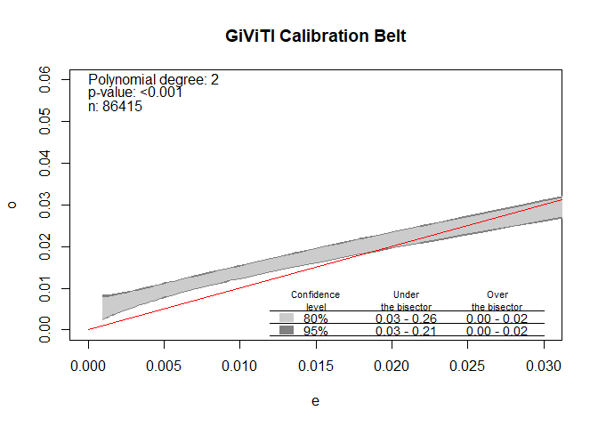
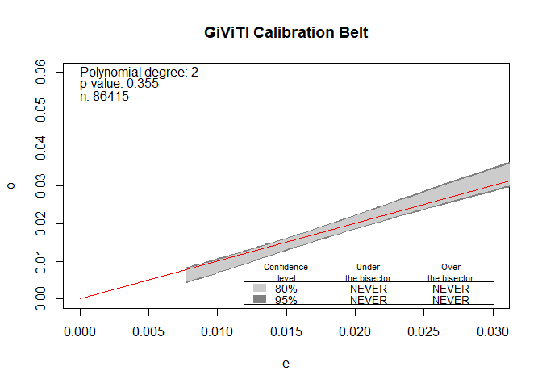

# Start

Install and attach some useful packages


```r
# First, set random seed for reproducability:
set.seed(123)

# USeful packages
pkgs <- c("tidyverse", "doParallel", "pROC", "rms", "givitiR")

# Install if not already installed
pkgsinst <- setdiff(pkgs, rownames(installed.packages()))
if (length(pkgsinst)) install.packages(pkgsinst)

# Attatch
purrr::walk(pkgs, ~suppressPackageStartupMessages(library(., character.only = TRUE)))
```

Load the exported models to validate (also found "manually" at [Github](https://github.com/eribul/NH_luxation_infektion/blob/master/cache/ext_val_required_data.RData)). This is a nested data frame with one row for each prediction period (90 days and 2 years). Column `fit` contains `glm` objects stripped from any personal patient data.


```r
# Load the exported model object
load("../cache/fit_brl_reduced_lean.RData")
fit_brl_reduced_lean
```

```
## # A tibble: 2 x 4
##   outcome   time  Model         fit   
##   <chr>     <chr> <chr>         <list>
## 1 infection 2y    Reduced model <glm> 
## 2 infection 90d   Reduced model <glm>
```

Let's inspect the model for 90 days just to get a sence of it:


```r
fit_brl_reduced_lean$fit[[1]]
```

```
## 
## Call:  glm(formula = f, family = binomial(), data = df)
## 
## Coefficients:
##                                          (Intercept)  
##                                             -4.49475  
##                                      P_BMIoverweight  
##                                              0.33308  
##                                 P_BMIclass I obesity  
##                                              0.67627  
##                            P_BMIclass II-III obesity  
##                                              1.09194  
##                     P_DiaGrpSecondary osteoarthritis  
##                                              0.51642  
##         P_DiaGrpSequelae after childhood hip disease  
##                                              0.07772  
## P_DiaGrpAvascular necrosis of the femoral head (AVN)  
##                                              0.41987  
##                   P_DiaGrpInflammatory joint disease  
##                                              0.66259  
##                                      c_psoriasisTRUE  
##                                              0.50518  
##                                    c_cns_diseaseTRUE  
##                                              0.37214  
##                                              P_ASAII  
##                                              0.28240  
##                                             P_ASAIII  
##                                              0.65987  
##                                            P_SexMale  
##                                              0.39640  
##                       c_pancreatic_insufficiencyTRUE  
##                                              0.47267  
##                                  c_liver_diseaseTRUE  
##                                              0.42204  
##                             c_drug_alcohol_abuseTRUE  
##                                              0.24986  
##                              c_rheumatic_diseaseTRUE  
##                                              0.33729  
##                                         c_cancerTRUE  
##                                              0.32745  
## 
## Degrees of Freedom: 86414 Total (i.e. Null);  86397 Residual
## Null Deviance:	    24840 
## Residual Deviance: 23920 	AIC: 23960
```

We should now use this model with the `predict` function combined with new data from Denmark. So, how should this data look like?


# Prepare data

## Inclusion/exlusion

Those were the inclusions/exclusions from Sweden. Similar criteria should apply also for the external validation data set in to get comparable cohorts. 

Ignore filtering of missing educational level, hospital type and fixation, however, since those variables are not needed in the model to validate. 


```r
knitr::include_graphics("../graphs/flowchart.png")
```


# Variables

## Outcome

The outcome variables are simply called `outcome` in each model (hence, adjusted for each model). Those are logical/boolean (or 0/1-numeric) indicating whether the patient got PJI within 90 days (2 years) after THA (`TRUE`/1) or not (`FALSE`/0). Note that we had previously excluded all patients who died within two years. A competing risk model for survival analysis might be better but we were pragmatic in this case. 


## Predictors

The data to evaluate (in addition to the respective `outcome` variable) should look like this:


```r
# Object I use on my end, which includes patient data and can therefore not be shared
head(ext_val_required_data) 
```

```
## # A tibble: 6 x 11
##   P_BMI P_DiaGrp c_psoriasis c_cns_disease P_ASA P_Sex c_pancreatic_in~
##   <fct> <fct>    <lgl>       <lgl>         <fct> <fct> <lgl>           
## 1 unde~ Primary~ FALSE       FALSE         II    Fema~ FALSE           
## 2 unde~ Primary~ FALSE       FALSE         II    Male  FALSE           
## 3 over~ Primary~ FALSE       FALSE         II    Male  FALSE           
## 4 clas~ Primary~ FALSE       FALSE         I     Male  FALSE           
## 5 over~ Seconda~ FALSE       FALSE         I     Male  FALSE           
## 6 clas~ Primary~ FALSE       TRUE          I     Male  FALSE           
## # ... with 4 more variables: c_liver_disease <lgl>, c_drug_alcohol_abuse <lgl>,
## #   c_rheumatic_disease <lgl>, c_cancer <lgl>
```

thus with columns: 


```r
names(ext_val_required_data)
```

```
##  [1] "P_BMI"                      "P_DiaGrp"                  
##  [3] "c_psoriasis"                "c_cns_disease"             
##  [5] "P_ASA"                      "P_Sex"                     
##  [7] "c_pancreatic_insufficiency" "c_liver_disease"           
##  [9] "c_drug_alcohol_abuse"       "c_rheumatic_disease"       
## [11] "c_cancer"
```
Some of those are factor variables:

```r
ext_val_required_data %>% 
  select(where(is.factor)) %>% 
  pivot_longer(everything(), values_ptypes = list(value = character())) %>% 
  distinct() %>% 
  arrange(name, value) %>% 
  group_by(name) %>% 
  mutate(name = replace(name, duplicated(name), ""))
```

```
## # A tibble: 14 x 2
## # Groups:   name [5]
##    name       value                                       
##    <chr>      <chr>                                       
##  1 "P_ASA"    I                                           
##  2 ""         II                                          
##  3 ""         III                                         
##  4 "P_BMI"    class I obesity                             
##  5 ""         class II-III obesity                        
##  6 ""         overweight                                  
##  7 ""         under/normal weight                         
##  8 "P_DiaGrp" Avascular necrosis of the femoral head (AVN)
##  9 ""         Inflammatory joint disease                  
## 10 ""         Primary osteoarthritis                      
## 11 ""         Secondary osteoarthritis                    
## 12 ""         Sequelae after childhood hip disease        
## 13 "P_Sex"    Female                                      
## 14 ""         Male
```
- `P_Sex` and `P_ASA` should be self-explanatory
- `P_BMI` is a broader categorization based on BMI and the [WHO classification] (https://www.euro.who.int/en/health-topics/disease-prevention/nutrition/a-healthy-lifestyle/body-mass-index-bmi) where overweight = "pre-obesity"  
- `P_DiaGrp` is based on ICD-10 codes recorded in SHAR and grouped into broader categories as found in a separate CSV-file:


```r
readr::read_csv2("../data/P_DiaGrp.csv", trim_ws = TRUE)
```

```
## # A tibble: 72 x 2
##    `Diagnos PrimärOp`                    Diagnosgrupp             
##    <chr>                                 <chr>                    
##  1 M16.9 - Koxartros, ospecificerad      Primär artros            
##  2 M16.1 - Koxartros, primär             Primär artros            
##  3 M16.0 - Koxartros, primär dubbelsidig Primär artros            
##  4 M15.0 - Polyartros                    Primär artros            
##  5 M24.6F - Ankylotisk led               Inflammatorisk ledsjukdom
##  6 M33.1 - Annan dermatomysit            Inflammatorisk ledsjukdom
##  7 M00.9F - Artrit UNS                   Inflammatorisk ledsjukdom
##  8 M13.8 - Artrit, annan specificerad    Inflammatorisk ledsjukdom
##  9 M45.9 - Bechterew, morbus             Inflammatorisk ledsjukdom
## 10 M65.9F - Ospecifik synovit            Inflammatorisk ledsjukdom
## # ... with 62 more rows
```


## Comorbidities

Variables prefixed by `c_`:


```r
nms     <- names(ext_val_required_data)
comorbs <- nms[startsWith(nms, "c_")]
comorbs
```

```
## [1] "c_psoriasis"                "c_cns_disease"             
## [3] "c_pancreatic_insufficiency" "c_liver_disease"           
## [5] "c_drug_alcohol_abuse"       "c_rheumatic_disease"       
## [7] "c_cancer"
```
are logical/boolean indicators of comorbidities based on ICD-10/ATC codes from one year prior to THA, as recorded in our National Patient Register and medical prescription register. INdividual codes were grouped according to Charlson and Elixhauser as codified by table 2 in @Quan2005, and as RxRisk V according to table 1 in @Pratt2018. Those conditions were then further combined according to table 1 in the drafted manuscript:


```r
comorbs_nms <- 
  comorbs %>% 
  tolower() %>% 
  {gsub("^c_", "", .)} %>%
  {gsub("_", " ", .)}

tab_categorization %>% 
  filter(
    tolower(`Comorbidities by groups`) %in% comorbs_nms
  )
```

```
## # A tibble: 7 x 4
## # Groups:   Comorbidities by groups [7]
##   `Comorbidities by~ Charlson          Elixhauser            Rx                 
##   <chr>              <chr>             <chr>                 <chr>              
## 1 Cancer             Malignancy, Meta~ Lymphoma, Metastatic~ Malignancies       
## 2 CNS disease        Dementia, Hemipl~ Depression, Paralysi~ Dementia, Depressi~
## 3 Drug alcohol abuse <NA>              Alcohol abuse, Drug ~ Alcohol dependence 
## 4 Liver disease      Mild liver disea~ Liver disease         Liver failure, Hep~
## 5 Pancreatic insuff~ <NA>              <NA>                  Pancreatic insuffi~
## 6 Psoriasis          <NA>              <NA>                  Psoriasis          
## 7 Rheumatic disease  Rheumatic disease Rheumatoid arthritis  <NA>
```


## Example validation for model of 90 days

We have the 90 day model from the shared R object;

```r
model <- fit_brl_reduced_lean$fit[[1]]
```

Let's assume we now have the `outcome` variable and a data frame `X` with the  predictors (I will use the Swedish data just as an example but this should of course be changed for the external validation).

```r
outcome <- df$outcome_infection_90d
X       <- ext_val_required_data
```


# Validation of model as is


```r
# Tibble with observed and predicted outcome
obspred <- 
  tibble(
    obs  = outcome, 
    pred = predict(model, X, type = "response")
  )

# ROC curve
ROC <- pROC::roc(obspred, "obs", "pred", direction = "<")

# Estimate CI for AUC based on bootstrapping
# Use parallel processing to speed up the process
doParallel::registerDoParallel()
AUCci <- 
  pROC::ci.auc(
    ROC, 
    method          = "bootstrap", 
    boot.n          = 100,     # Remove this argument and use the default!
    boot.stratified = FALSE, 
    parallel        = TRUE
  )


# Check calibration. Note that devel should actually be "internal" for this example but I use
# "external", since that's what you will use for the external validation. 
calibration <- 
  givitiR::givitiCalibrationBelt(
    as.numeric(obspred$obs), 
    obspred$pred, 
    devel = "external"
  )
```

## Results

For this example we had AUC:


```r
AUCci
```

```
## 95% CI: 0.653-0.6765 (100 non-stratified bootstrap replicates)
```

```r
plot(ROC)
```

<!-- -->

A calibration belt plot might be illustrated as (this example might look strange due to the intentional internal/external miss-specification above):


```r
plot(calibration, xlim = c(0, 0.3), ylim = c(0, 0.3))
```

<!-- -->

```
## $m
## [1] 2
## 
## $p.value
## [1] 0
```

# Re-calibrated intercept

Method 2 from table 1 in @Steyerberg2004.


```r
Z <- predict(model, X, type = "response")
  
# Refit the intercept using Z = a + Xb from above as offset
fit2 <- glm(outcome ~ 1, offset = Z)

# Same calibration and validation as above
obspred2     <- tibble(obs  = outcome, pred = predict(fit2, type = "response"))
ROC2         <- pROC::roc(obspred2, "obs", "pred", direction = "<")
AUCci2 <- 
  pROC::ci.auc(
    ROC2, 
    method = "bootstrap", 
    boot.n = 100,     # Remove this argument and use the default!
    boot.stratified = FALSE, 
    parallel = TRUE
  )

calibration2 <- 
  givitiR::givitiCalibrationBelt(
    as.numeric(obspred2$obs), 
    obspred2$pred, 
    devel = "external"
  )
```

## Results


```r
AUCci2
```

```
## 95% CI: 0.6492-0.6749 (100 non-stratified bootstrap replicates)
```

```r
plot(ROC2)
```

<!-- -->

```r
plot(calibration2, xlim = c(0, 0.03), ylim = c(0, 0.06))
```

<!-- -->

```
## $m
## [1] 2
## 
## $p.value
## [1] 0
```


# Re-calibration of intercenpt and calibration slope

Method 3 from table 1 in @Steyerberg2004.


```r
fit3         <- glm(outcome ~ 1 + Z)
obspred3     <- tibble(obs  = outcome, pred = predict(fit3, type = "response"))
ROC3         <- pROC::roc(obspred3, "obs", "pred", direction = "<")

AUCci3 <- 
  pROC::ci.auc(
    ROC3, 
    method = "bootstrap", 
    boot.n = 100,     # Remove this argument and use the default!
    boot.stratified = FALSE, 
    parallel = TRUE
  )

calibration3 <- 
  givitiR::givitiCalibrationBelt(
    as.numeric(obspred3$obs), 
    obspred3$pred, 
    devel = "external"
  )
```


## Results


```r
AUCci3
```

```
## 95% CI: 0.6532-0.6731 (100 non-stratified bootstrap replicates)
```

```r
plot(ROC3)
```

<!-- -->

```r
plot(calibration3, xlim = c(0, 0.03), ylim = c(0, 0.06))
```

<!-- -->

```
## $m
## [1] 2
## 
## $p.value
## [1] 0.3549266
```


# Export data to Sweden

## ROC 

If it would be OK to export coordinates for ROC-plots I would recommend this code to extract only the minimal data needed:


```r
roc_plot_coords <- 
  tibble(
    model = c("ias is", "re-calibrated intercept", "recalibrated"),
    data = 
      list( 
        tibble(
          specificities = ROC$specificities, 
          sensitivities = ROC$sensitivities
        ),
        tibble(
          specificities = ROC2$specificities, 
          sensitivities = ROC2$sensitivities
        ),
        tibble(
          specificities = ROC3$specificities, 
          sensitivities = ROC3$sensitivities
        )
      )
  )
```

## AUC with CI

The text output from `AUCci`, `AUCci2` and `AUCci3` should be enough. Hence, the same character string that gets printed above (but now stored in an object).

```r
AUCci_print  <- capture.output(AUCci)
AUCci2_print <- capture.output(AUCci2)
AUCci3_print <- capture.output(AUCci3)
```

## Export objects

Save objects above to file `export_90d.RData` (in the current working directory).


```r
save(
  roc_plot_coords,
  AUCci_print,
  AUCci2_print,
  AUCci3_print,
  calibration,
  calibration2,
  calibration3,
  file = "export_90d.RData"
)
```


# 2 years

Repeat for the 2-year model.


# Bibliography
