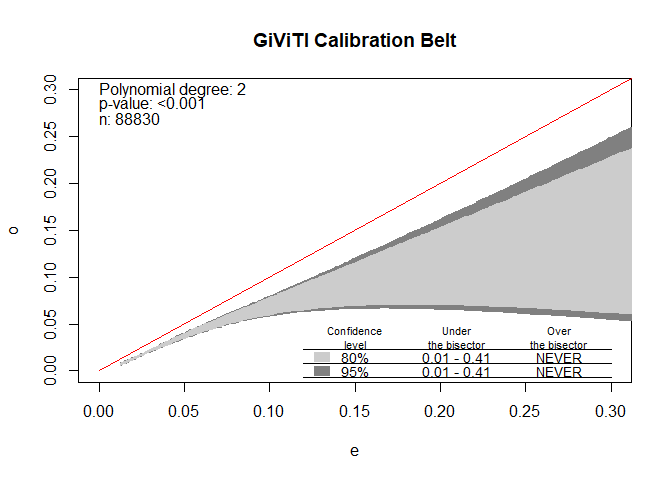
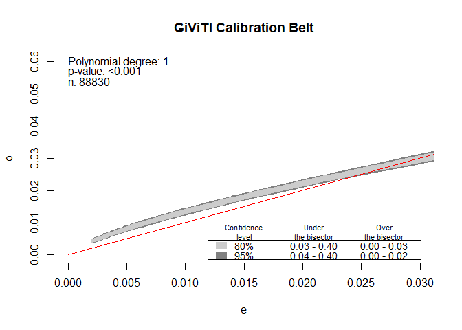

External validation
================
Erik Bulow
2020-10-23

  - [Start](#start)
  - [Prepare data](#prepare-data)
      - [Inclusion/exlusion](#inclusionexlusion)
  - [Variables](#variables)
      - [Outcome](#outcome)
      - [Predictors](#predictors)
      - [Comorbidities](#comorbidities)
      - [Example validation for model of 90
        days](#example-validation-for-model-of-90-days)
  - [Validation of model as is](#validation-of-model-as-is)
      - [Results](#results)
  - [Re-calibrated intercept](#re-calibrated-intercept)
      - [Results](#results-1)
  - [Re-calibration of intercenpt and calibration
    slope](#re-calibration-of-intercenpt-and-calibration-slope)
      - [Results](#results-2)
  - [Export data to Sweden](#export-data-to-sweden)
      - [ROC](#roc)
      - [AUC with CI](#auc-with-ci)
      - [Export objects](#export-objects)
  - [2 years](#years)
  - [Bibliography](#bibliography)

# Start

Install and attach some useful packages

``` r
# First, set random seed for reproducability:
set.seed(123)

# USeful packages
pkgs <- c("tidyverse", "doParallel", "pROC", "rms", "givitiR")

# Install if not already installed
pkgsinst <- setdiff(pkgs, rownames(installed.packages()))
if (length(pkgsinst)) install.packages(pkgsinst)

# Attatch
purrr::walk(pkgs, ~suppressPackageStartupMessages(library(., character.only = TRUE)))
```

Load the exported models to validate (also found “manually” at
[Github](https://github.com/eribul/NH_luxation_infektion/blob/master/cache/ext_val_required_data.RData)).
This is a nested data frame with one row for each prediction period (90
days and 2 years). Column `fit` contains `glm` objects stripped from any
personal patient data.

``` r
# Load the exported model object
load("../cache/fit_brl_reduced_lean.RData")
```

Let’s inspect the model for 90 days just to get a sence of it:

``` r
fit_brl_reduced_lean$fit[[1]]
```

    ## 
    ## Call:  glm(formula = f, family = binomial(), data = df)
    ## 
    ## Coefficients:
    ##                                          (Intercept)  
    ##                                             -4.37991  
    ##                                         c_cancerTRUE  
    ##                                              0.39287  
    ##                                    c_cns_diseaseTRUE  
    ##                                              0.59655  
    ##                                  c_liver_diseaseTRUE  
    ##                                              0.55059  
    ##                              c_rheumatic_diseaseTRUE  
    ##                                              0.33489  
    ##                                              P_ASAII  
    ##                                              0.34348  
    ##                                             P_ASAIII  
    ##                                              0.75502  
    ##                                      P_BMIoverweight  
    ##                                              0.30040  
    ##                                 P_BMIclass I obesity  
    ##                                              0.63610  
    ##                            P_BMIclass II-III obesity  
    ##                                              1.04056  
    ##                     P_DiaGrpSecondary osteoarthritis  
    ##                                              0.53775  
    ##         P_DiaGrpSequelae after childhood hip disease  
    ##                                              0.04766  
    ## P_DiaGrpAvascular necrosis of the femoral head (AVN)  
    ##                                              0.48694  
    ##                   P_DiaGrpInflammatory joint disease  
    ##                                              0.62063  
    ##                                            P_SexMale  
    ##                                              0.33145  
    ##                             c_drug_alcohol_abuseTRUE  
    ##                                              0.22273  
    ##                                   c_peptic_ulcerTRUE  
    ##                                              0.35725  
    ##                    c_fluid_electrolyte_disordersTRUE  
    ##                                              0.38245  
    ## 
    ## Degrees of Freedom: 88829 Total (i.e. Null);  88812 Residual
    ## Null Deviance:       26290 
    ## Residual Deviance: 25360     AIC: 25400

We should now use this model with the `predict` function combined with
new data from Denmark. So, how should this data look like?

# Prepare data

## Inclusion/exlusion

Those were the inclusions/exclusions from Sweden. Similar criteria
should apply also for the external validation data set to get comparable
cohorts.

Ignore filtering of missing educational level, hospital type and
fixation, however, since those variables are not needed in the model to
validate.

``` r
knitr::include_graphics("../graphs/flowchart.png")
```


# Variables

## Outcome

The outcome variables are simply called `outcome` in each model (hence,
adjusted for each model). Those are logical/boolean (or 0/1-numeric)
indicating whether the patient got PJI within 90 days (2 years) after
THA (`TRUE`/1) or not (`FALSE`/0). Note that we had previously excluded
all patients who died within two years. A competing risk model for
survival analysis might be better but we were pragmatic in this case.

We identified PJI within 90 days/2 years as either the primary or
secondary reson for reoperation performed within this time frame, as
recorded to SHAR, or if a relevant ICD-10/NOMESCO code was recorded
during a hospitl visit/admission during this period.

We used regular expression to identify such codes:

``` r
coder::hip_ae_hailer %>% 
  filter(group == "Infection")
```

<div class="kable-table">

| group     | icd10                                                          | kva             |
| :-------- | :------------------------------------------------------------- | :-------------- |
| Infection | (M(00(1|\[0289\]F?)|86(\[01\]F|6F?)))|T(8(14|4(5\[FX\]?|7F?))) | NFS\[0-9\]{0,2} |

</div>

## Predictors

The data to evaluate (in addition to the respective `outcome` variable)
should look like this:

``` r
head(ext_val_required_data) 
```

<div class="kable-table">

| c\_cancer | c\_cns\_disease | c\_liver\_disease | c\_rheumatic\_disease | P\_ASA | P\_BMI               | P\_DiaGrp              | P\_Sex | c\_drug\_alcohol\_abuse | c\_peptic\_ulcer | c\_fluid\_electrolyte\_disorders | c\_arrhythmia |
| :-------- | :-------------- | :---------------- | :-------------------- | :----- | :------------------- | :--------------------- | :----- | :---------------------- | :--------------- | :------------------------------- | :------------ |
| FALSE     | FALSE           | FALSE             | FALSE                 | III    | overweight           | Primary osteoarthritis | Female | FALSE                   | FALSE            | FALSE                            | FALSE         |
| FALSE     | FALSE           | FALSE             | FALSE                 | II     | under/normal weight  | Primary osteoarthritis | Female | FALSE                   | FALSE            | FALSE                            | FALSE         |
| FALSE     | FALSE           | FALSE             | FALSE                 | I      | under/normal weight  | Primary osteoarthritis | Female | FALSE                   | FALSE            | FALSE                            | FALSE         |
| FALSE     | FALSE           | FALSE             | TRUE                  | II     | overweight           | Primary osteoarthritis | Female | FALSE                   | FALSE            | FALSE                            | FALSE         |
| FALSE     | FALSE           | FALSE             | FALSE                 | II     | overweight           | Primary osteoarthritis | Female | FALSE                   | FALSE            | FALSE                            | FALSE         |
| FALSE     | FALSE           | FALSE             | FALSE                 | II     | class II-III obesity | Primary osteoarthritis | Female | FALSE                   | FALSE            | FALSE                            | FALSE         |

</div>

thus with columns:

``` r
names(ext_val_required_data)
```

    ##  [1] "c_cancer"                      "c_cns_disease"                
    ##  [3] "c_liver_disease"               "c_rheumatic_disease"          
    ##  [5] "P_ASA"                         "P_BMI"                        
    ##  [7] "P_DiaGrp"                      "P_Sex"                        
    ##  [9] "c_drug_alcohol_abuse"          "c_peptic_ulcer"               
    ## [11] "c_fluid_electrolyte_disorders" "c_arrhythmia"

Some of those are factor variables:

``` r
ext_val_required_data %>% 
  select(where(is.factor)) %>% 
  pivot_longer(everything(), values_ptypes = list(value = character())) %>% 
  distinct() %>% 
  arrange(name, value) %>% 
  group_by(name) %>% 
  mutate(name = replace(name, duplicated(name), ""))
```

<div class="kable-table">

| name      | value                                        |
| :-------- | :------------------------------------------- |
| P\_ASA    | I                                            |
|           | II                                           |
|           | III                                          |
| P\_BMI    | class I obesity                              |
|           | class II-III obesity                         |
|           | overweight                                   |
|           | under/normal weight                          |
| P\_DiaGrp | Avascular necrosis of the femoral head (AVN) |
|           | Inflammatory joint disease                   |
|           | Primary osteoarthritis                       |
|           | Secondary osteoarthritis                     |
|           | Sequelae after childhood hip disease         |
| P\_Sex    | Female                                       |
|           | Male                                         |

</div>

  - `P_Sex` and `P_ASA` should be self-explanatory
  - `P_BMI` is a broader categorization based on BMI and the \[WHO
    classification\]
    (<https://www.euro.who.int/en/health-topics/disease-prevention/nutrition/a-healthy-lifestyle/body-mass-index-bmi>)
    where overweight = “pre-obesity”  
  - `P_DiaGrp` is based on ICD-10 codes recorded in SHAR and grouped
    into broader categories.

<!-- end list -->

``` r
readr::read_csv2("../data/P_DiaGrp.csv", trim_ws = TRUE)
```

<div class="kable-table">

| Diagnos PrimärOp                                           | Diagnosgrupp                                                    |
| :--------------------------------------------------------- | :-------------------------------------------------------------- |
| M16.9 - Koxartros, ospecificerad                           | Primär artros                                                   |
| M16.1 - Koxartros, primär                                  | Primär artros                                                   |
| M16.0 - Koxartros, primär dubbelsidig                      | Primär artros                                                   |
| M15.0 - Polyartros                                         | Primär artros                                                   |
| M24.6F - Ankylotisk led                                    | Inflammatorisk ledsjukdom                                       |
| M33.1 - Annan dermatomysit                                 | Inflammatorisk ledsjukdom                                       |
| M00.9F - Artrit UNS                                        | Inflammatorisk ledsjukdom                                       |
| M13.8 - Artrit, annan specificerad                         | Inflammatorisk ledsjukdom                                       |
| M45.9 - Bechterew, morbus                                  | Inflammatorisk ledsjukdom                                       |
| M65.9F - Ospecifik synovit                                 | Inflammatorisk ledsjukdom                                       |
| M07.3F - Psoriasisartrit                                   | Inflammatorisk ledsjukdom                                       |
| M02.9F - Reaktiv artrit UNS                                | Inflammatorisk ledsjukdom                                       |
| M08.0F - Reumatoid artrit juvenil                          | Inflammatorisk ledsjukdom                                       |
| M05.8F - Reumatoid artrit seropos                          | Inflammatorisk ledsjukdom                                       |
| M06.9F - Reumatoid artrit UNS                              | Inflammatorisk ledsjukdom                                       |
| M05.9F - Seropositiv reumatoid artrit, ospec               | Inflammatorisk ledsjukdom                                       |
| M32.9 - Systemisk lupus etrythematosus, ospec              | Inflammatorisk ledsjukdom                                       |
| S72.00 - Collumfraktur                                     | Akut trauma, höftfraktur                                        |
| S72.10 - Pertrokantär fraktur                              | Akut trauma, höftfraktur                                        |
| S72.20 - Subtrokantär fraktur                              | Akut trauma, höftfraktur                                        |
| M91.8 - Annan spec juvenil osteokondros i höft och bäcken  | Följdtillstånd efter barnsjukdom i höftleden                    |
| M91.2 - Coxa plana (sen diagnos)                           | Följdtillstånd efter barnsjukdom i höftleden                    |
| M21.0F - Coxa valga                                        | Följdtillstånd efter barnsjukdom i höftleden                    |
| M21.1F - Coxa vara                                         | Följdtillstånd efter barnsjukdom i höftleden                    |
| M93.0 - Förskjuten övre femurepifys (icke traumatisk)      | Följdtillstånd efter barnsjukdom i höftleden                    |
| M16.3 - Koxartros, annan dysplastisk                       | Följdtillstånd efter barnsjukdom i höftleden                    |
| M16.2 - Koxartros, orsakad av dysplasi, dubbelsidig        | Följdtillstånd efter barnsjukdom i höftleden                    |
| M91.1 - Perthes sjukdom                                    | Följdtillstånd efter barnsjukdom i höftleden                    |
| M87.3F - Annan sekundär osteonekros                        | Idiopatisk nekros                                               |
| M87.0F - Osteonekros                                       | Idiopatisk nekros                                               |
| M87.1F - Osteonekros orsakad av läkemedel                  | Idiopatisk nekros                                               |
| T93.1 - Collumfraktur, sena besvär efter                   | Komplikation eller följdtillstånd efter fraktur el annat trauma |
| M84.0F - Felläkning av fraktur                             | Komplikation eller följdtillstånd efter fraktur el annat trauma |
| M84.2F - Fördröjd frakturläkning i höftled/lårben          | Komplikation eller följdtillstånd efter fraktur el annat trauma |
| T84.6F - Infektion efter osteosyntes                       | Komplikation eller följdtillstånd efter fraktur el annat trauma |
| T84.3F - Mek kompl av andra instrument, implantat          | Komplikation eller följdtillstånd efter fraktur el annat trauma |
| T84.1 - Mek kompl instr för inre fix av extremitetsben     | Komplikation eller följdtillstånd efter fraktur el annat trauma |
| M87.2F - Ostenekros efter tidigare skada                   | Komplikation eller följdtillstånd efter fraktur el annat trauma |
| T91.2 - Sena besvär av annan frakt på br-korgen o bäckenet | Komplikation eller följdtillstånd efter fraktur el annat trauma |
| M84.1F - Utebliven läkning/pseudartros                     | Komplikation eller följdtillstånd efter fraktur el annat trauma |
| M90.7F - Benfraktur vid tumörsjukdom                       | Tumör                                                           |
| D16.2 - Benign tumör i nedre extremiteterna                | Tumör                                                           |
| C41.4 - Malign tumör i bäckenben, sakrum och coccyx        | Tumör                                                           |
| C40.2 - Malign tumör i nedre extremiteternas långa ben     | Tumör                                                           |
| C90.0 - Myelomatos                                         | Tumör                                                           |
| M84.4F - Patologisk fraktur UNS                            | Tumör                                                           |
| C79.5 - Sek malign tumör (metastas) i ben och benmärg      | Tumör                                                           |
| D21.2 - Synovial chondromatos                              | Tumör                                                           |
| D48.0 - Tumör av osäker el. okänd natur i ben och ledbrosk | Tumör                                                           |
| M16.5 - Koxartros, annan posttraumatisk                    | Annan sekundär artros                                           |
| M16.7 - Koxartros, annan sekundär                          | Annan sekundär artros                                           |
| M16.6 - Koxartros, annan sekundär dubbelsidig              | Annan sekundär artros                                           |
| M16.4 - Koxartros, posttraumatisk dubbelsidig              | Annan sekundär artros                                           |
| S32.40 - Fraktur på acetabulum                             | Akut trauma, övriga                                             |
| S72.30 - Fraktur på femurskaftet                           | Akut trauma, övriga                                             |
| S73.0 - Luxation i höft                                    | Akut trauma, övriga                                             |
| M84.3F - Stressfraktur                                     | Akut trauma, övriga                                             |
| M80.0F - Åldersosteoporos m fraktur                        | Akut trauma, övriga                                             |
| M94.8 - Andra spec sjukdomar i brosk                       | Övrigt                                                          |
| M00.8 - Artrit och polyartrit ors av annan spec bakterie   | Övrigt                                                          |
| M36.2 - Artropati vid hemofili                             | Övrigt                                                          |
| M25.5F - Ledvärk                                           | Övrigt                                                          |
| M93.2F - Osteochondrosis dissecans                         | Övrigt                                                          |
| M89.5 - Osteolys                                           | Övrigt                                                          |
| M86.6F - Osteomyelit, annan specificerad kronisk           | Övrigt                                                          |
| M88.8 - Pagets sjukdom i andra specificerade ben           | Övrigt                                                          |
| M96.0F - Pseudartros efter artrodes                        | Övrigt                                                          |
| M24.4F - Recidiverande lux och sublux i led                | Övrigt                                                          |
| M89.9 - Sjukdom i benvävnad, ospecificerad                 | Övrigt                                                          |
| M79.6F - Smärta ospecifik                                  | Övrigt                                                          |
| M90.0F - TBC i benvävnad                                   | Övrigt                                                          |
| M12.2F - Villonodulär synovit                              | Övrigt                                                          |

</div>

## Comorbidities

Variables prefixed by `c_`:

``` r
nms     <- names(ext_val_required_data)
comorbs <- nms[startsWith(nms, "c_")]
comorbs
```

    ## [1] "c_cancer"                      "c_cns_disease"                
    ## [3] "c_liver_disease"               "c_rheumatic_disease"          
    ## [5] "c_drug_alcohol_abuse"          "c_peptic_ulcer"               
    ## [7] "c_fluid_electrolyte_disorders" "c_arrhythmia"

… are logical/boolean indicators of comorbidities based on ICD-10/ATC
codes from one year prior to THA, as recorded in our National Patient
Register and medical prescription register. Individual codes were
grouped according to Charlson and Elixhauser as codified by table 2 in
@Quan2005, and as RxRisk V according to table 1 in @Pratt2018. Those
conditions were then further combined according to table 1 in the
drafted manuscript:

``` r
comorbs_nms <- 
  comorbs %>% 
  tolower() %>% 
  {gsub("^c_", "", .)} %>%
  {gsub("_", " ", .)}

tab_categorization %>% 
  filter(
    tolower(`Comorbidities by groups`) %in% comorbs_nms
  )
```

<div class="kable-table">

| Comorbidities by groups     | Charlson                                             | Elixhauser                                                     |
| :-------------------------- | :--------------------------------------------------- | :------------------------------------------------------------- |
| Arrhythmia                  | NA                                                   | Cardiac arrhythmias                                            |
| Cancer                      | Malignancy, Metastatic solid tumor                   | Lymphoma, Metastatic cancer, Solid tumor                       |
| CNS disease                 | Dementia, Hemiplegia or paraplegia                   | Depression, Paralysis, Other neurological disorders, Psychoses |
| Drug alcohol abuse          | NA                                                   | Alcohol abuse, Drug abuse                                      |
| Fluid electrolyte disorders | NA                                                   | Fluid electrolyte disorders                                    |
| Liver disease               | Mild liver disease, Moderate or severe liver disease | Liver disease                                                  |
| Peptic ulcer                | Peptic ulcer disease                                 | Peptic ulcer disease                                           |
| Rheumatic disease           | Rheumatic disease                                    | Rheumatoid arthritis                                           |

</div>

## Example validation for model of 90 days

We have the 90 day model from the shared R object;

``` r
model <- fit_brl_reduced_lean$fit[[1]]
```

Let’s assume we now have the `outcome` variable and a data frame `X`
with the predictors (I will use the Swedish data just as an example but
this should of course be changed for the external validation).

``` r
outcome <- df$outcome_infection_90d
X       <- ext_val_required_data
```

# Validation of model as is

``` r
# Tibble with observed and predicted outcome
obspred <- 
  tibble(
    obs  = outcome, 
    pred = predict(model, X, type = "response")
  )

# ROC curve
ROC <- pROC::roc(obspred, "obs", "pred", direction = "<")

# Estimate CI for AUC based on bootstrapping
# Use parallel processing to speed up the process
doParallel::registerDoParallel()
AUCci <- 
  pROC::ci.auc(
    ROC, 
    method          = "bootstrap", 
    boot.n          = 100,     # Remove this argument and use the default!
    boot.stratified = FALSE, 
    parallel        = TRUE
  )


# Check calibration. Note that devel should actually be "internal" for this example but I use
# "external", since that's what you will use for the external validation. 
calibration <- 
  givitiR::givitiCalibrationBelt(
    as.numeric(obspred$obs), 
    obspred$pred, 
    devel = "external"
  )
```

## Results

For this example we had AUC:

``` r
AUCci
```

    ## 95% CI: 0.6486-0.6726 (100 non-stratified bootstrap replicates)

``` r
plot(ROC)
```

<!-- -->

``` r
plot(calibration, xlim = c(0, 0.3), ylim = c(0, 0.3))
```

<!-- -->

    ## $m
    ## [1] 2
    ## 
    ## $p.value
    ## [1] 0

# Re-calibrated intercept

Method 2 from table 1 in @Steyerbeg2004.

``` r
Z <- predict(model, X, type = "response")
  
# Refit the intercept using Z = a + Xb from above as offset
fit2 <- glm(outcome ~ 1, offset = Z)

# Same calibration and validation as above
obspred2     <- tibble(obs  = outcome, pred = predict(fit2, type = "response"))
ROC2         <- pROC::roc(obspred2, "obs", "pred", direction = "<")
AUCci2 <- 
  pROC::ci.auc(
    ROC2, 
    method = "bootstrap", 
    boot.n = 100,     # Remove this argument and use the default!
    boot.stratified = FALSE, 
    parallel = TRUE
  )

calibration2 <- 
  givitiR::givitiCalibrationBelt(
    as.numeric(obspred2$obs), 
    obspred2$pred, 
    devel = "external"
  )
```

## Results

``` r
AUCci2
```

    ## 95% CI: 0.6493-0.6745 (100 non-stratified bootstrap replicates)

``` r
plot(ROC2)
```

<!-- -->

``` r
plot(calibration2, xlim = c(0, 0.03), ylim = c(0, 0.06))
```

<!-- -->

    ## $m
    ## [1] 1
    ## 
    ## $p.value
    ## [1] 0

# Re-calibration of intercenpt and calibration slope

Method 3 from table 1 in @Steyerberg2004.

``` r
fit3         <- glm(outcome ~ 1 + Z)
obspred3     <- tibble(obs  = outcome, pred = predict(fit3, type = "response"))
ROC3         <- pROC::roc(obspred3, "obs", "pred", direction = "<")

AUCci3 <- 
  pROC::ci.auc(
    ROC3, 
    method = "bootstrap", 
    boot.n = 100,     # Remove this argument and use the default!
    boot.stratified = FALSE, 
    parallel = TRUE
  )

calibration3 <- 
  givitiR::givitiCalibrationBelt(
    as.numeric(obspred3$obs), 
    obspred3$pred, 
    devel = "external"
  )
```

## Results

``` r
AUCci3
```

    ## 95% CI: 0.6531-0.6734 (100 non-stratified bootstrap replicates)

``` r
plot(ROC3)
```

<!-- -->

``` r
plot(calibration3, xlim = c(0, 0.03), ylim = c(0, 0.06))
```

<!-- -->

    ## $m
    ## [1] 2
    ## 
    ## $p.value
    ## [1] 0.03472188

# Export data to Sweden

## ROC

If it would be OK to export coordinates for ROC-plots I would recommend
this code to extract only the minimal data needed:

``` r
roc_plot_coords <- 
  tibble(
    model = c("ias is", "re-calibrated intercept", "recalibrated"),
    data = 
      list( 
        tibble(
          specificities = ROC$specificities, 
          sensitivities = ROC$sensitivities
        ),
        tibble(
          specificities = ROC2$specificities, 
          sensitivities = ROC2$sensitivities
        ),
        tibble(
          specificities = ROC3$specificities, 
          sensitivities = ROC3$sensitivities
        )
      )
  )
```

## AUC with CI

The text output from `AUCci`, `AUCci2` and `AUCci3` should be enough.
Hence, the same character string that gets printed above (but now stored
in an object).

``` r
AUCci_print  <- capture.output(AUCci)
AUCci2_print <- capture.output(AUCci2)
AUCci3_print <- capture.output(AUCci3)
```

## Export objects

Save objects above to file `export_90d.RData` (in the current working
directory).

``` r
save(
  roc_plot_coords,
  AUCci_print,
  AUCci2_print,
  AUCci3_print,
  calibration,
  calibration2,
  calibration3,
  file = "export_90d.RData"
)
```

# 2 years

Repeat for the 2-year model.

# Bibliography
