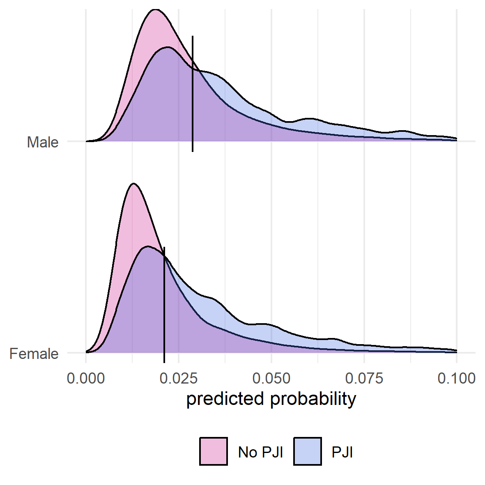
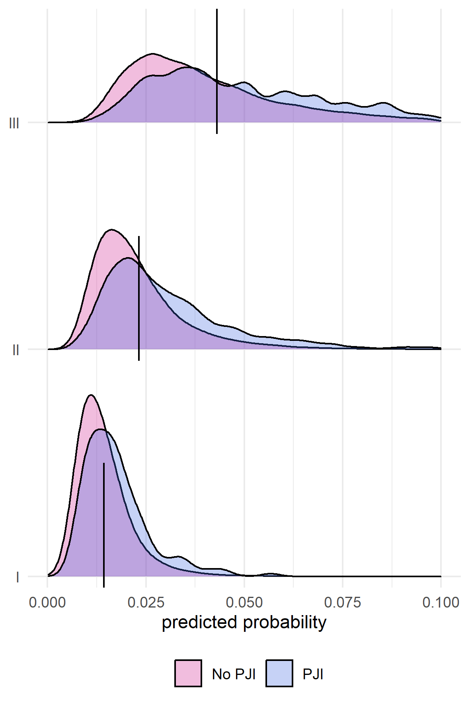
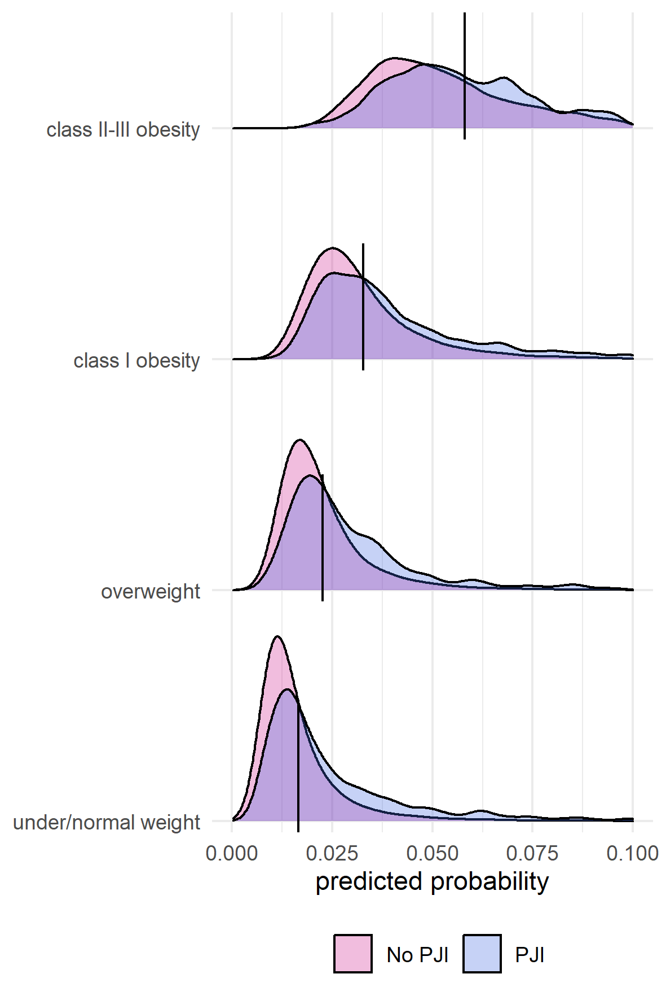
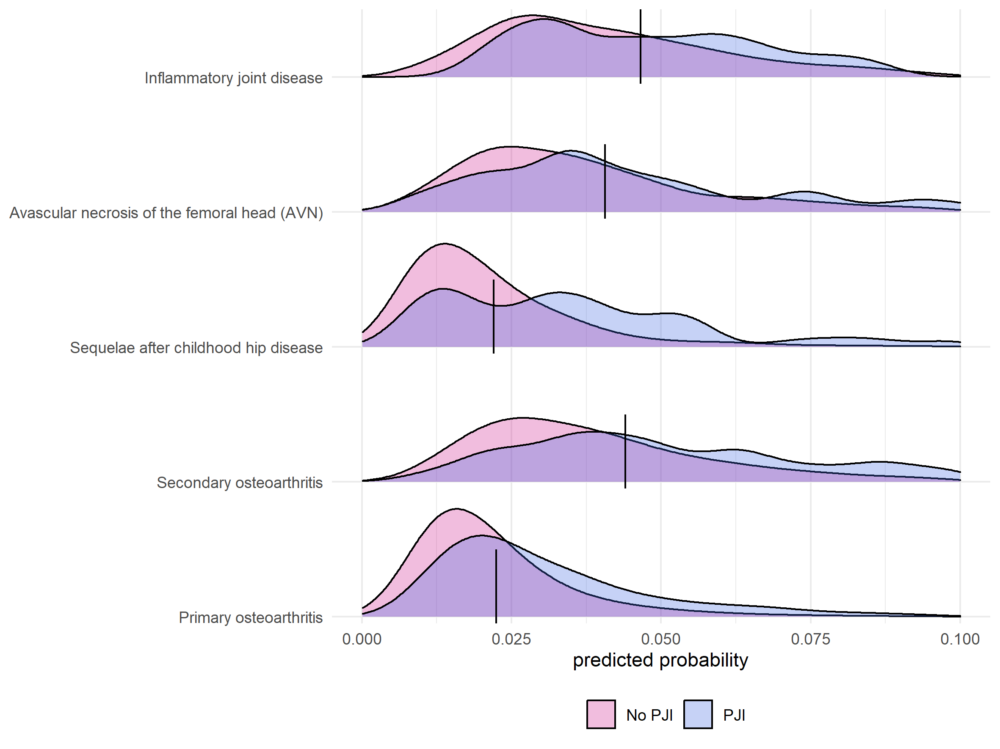

```{r setup, include = FALSE}
options(
  digits         = 2,
  knitr.kable.NA = '',
  repos          = list(CRAN = "https://cran.rstudio.com/")
)

knitr::opts_chunk$set(
  echo       = FALSE,
  out.width  = "100%", 
  out.height = "100%"
)

library(tidyverse)

nmbr <- function(x) format(as.numeric(trimws(as.character(x))), big.mark = ",") 

# Pre-load all cached files < 10 MB
cache_files <- dir("../cache", ".RData", full.names = TRUE)
filesizes <- do.call(file.size, list(cache_files)) / 2^20
Vectorize(load, "file")(cache_files[filesizes < 10], .GlobalEnv)
```

1.  The Swedish Arthroplasty Register, Gothenburg, Sweden
2.  Department of Orthopaedics, Institute of Clinical Sciences, The Sahlgrenska Academy, University of Gothenburg, Gothenburg, Sweden
3.  Department of Clinical Medicine, Department of Clinical Epidemiology, Aarhus university, Aarhus, Denmark
4.  Department Surgical Sciences/Orthopaedics, Uppsala University Hospital, Uppsala, Sweden

**Correspondence:** [erik.bulow@gu.se](mailto:erik.bulow@gu.se); +46 70 08 234 28; The Swedish Arthroplasty Register, Registercentrum Västra Götaland, SE-413 45, Sweden

# Note!

Most text in the article is automatically generated! Bold text is not! It is thus possible that this text does not correspond to the rest! It must be updated manually!

##### PAGE BREAK

```{r}
# Participants and methods --------------------------------------------
N_shar <- 
  table1 %>% 
  filter(what == "Total") %>% 
  select(`SE Total`) %>% 
  pluck(1)

N_dk <- 
  table1 %>% 
  filter(what == "Total") %>% 
  select(`DK Total`) %>% 
  pluck(1)

period <- paste(range(df$P_SurgYear), collapse = "-")


# Results -------------------------------------------------------------
crude_rate <- sum(df$outcome) / nrow(df)

get_auc <- function(model, version = "1", Country = "Sweden") {
  data_auc_ci %>% 
  filter(Model == model, country == Country) %>% 
  select(ends_with(version)) %>% 
  pluck(1)
}
```

# Abstract

**OJECTIVE:** Previous attempts at developing risk calculators for periprosthetic joint infection (PJI)  after total hip arthroplasty (THA) are hampered by poor predictive performance of the proposed models or a lack of external validation, and no published model is derived on a European population. We thus developed a parsimonious model to predict PJI within 90 days after elective THA.

**PARTICIPANTS AND METHODS:** This prediction model was derived on `r nmbr(N_shar)` patients from the Swedish Hip Arthroplasty Register and validated on `r nmbr(N_dk)` patients from the Danish Hip Arthroplasty Register. Data on comorbidities and socioeconomic background variables on all patients were obtained from the National Registers. Logistic least absolute shrinkage and selection operator (LASSO) regression was applied to develop prediction models for PJI within 90 days after surgery. We assessed model performance by the area under the receiver operation characteristics curve (AUC), calibration belt plots and the fraction of new information.

**RESULTS:** The crude incidence rate of PJI after THA was `r crude_rate * 100` % within 90 days in the Swedish derivation cohort and **X.XX %** in Denmark. A prediction model for PJI within 90 days combined `r coefs_text`, resulting in an `r get_auc("Reduced model", "2")` internally and `r sub("^AUC = ", "", get_auc("Reduced model", "2", Country = "Denmark"))` externally. These models were superior to traditional models based on the American Society for Anesthesiologists (ASA) classification `r get_auc("ASA")`, or the Charlson `r get_auc("Charlson")`, Elixhauser `r get_auc("Elixhauser")`, and Rx Risk V `r get_auc("Rx Risk")` comorbidity indices.

**CONCLUSION:** Our parsimonious prediction model for PJI after THA is based on easily accessible clinical data, and it is superior to predictions based on ASA class alone or more complex comorbidity indices. Our web-based calculator could simplify the individualized assessment of the risk of developing PJI prior to THA surgery and enable risk-stratified patient management. Nonetheless, the remaining unexplained variance indicates that unmeasured factors play an important role in the pathogenesis of PJI.

##### PAGE BREAK

# Introduction

Periprosthetic joint infection (PJI) is the most devastating of early complications after total hip arthroplasty (THA), mainly due to its severity in terms of increased mortality, the required number of re-operations, long-term antibiotic treatment, and often persistently impaired quality of life.[@Zimmerli2006; @Kapadia2016; @Shohat2019] Many risk factors for the development of PJI are identified, with anaemia, diabetes, and obesity being important, to some extent modifiable risk factors, whereas advanced age and male sex are examples of non-modifiable risk factors.[@Ridgeway2005; @Lai2007; @Malinzak2009; @Ong2009; @Pedersen2010; @Bozic2012; @Jamsen2012; @Rasouli2014a; @Maoz2015] Individualized PJI risk stratification would be a highly desirable tool in the pre-operative assessment of patients scheduled for THA, but established measures of comorbidity such as the American Society for Anesthesiologists' (ASA) classification or considerably more complex comorbidity indices cannot be used in this context. Although high ASA class is a risk factor associated with development of PJI, this classification is imprecise, and it was never developed for the purpose of predicting this specific complication.[@Haynes1995; @Berbari2012] The Charlson[@Charlson1987] and Elixhauser[@Elixhauser1998] comorbidity indices are based on `r nrow(coder::charlson)` or `r nrow(coder::elixhauser)` conditions according to the International Classification of Diseases (ICD), respectively, but they are cumbersome to use in a clinical setting, and they were also not designed for prediction of specific adverse events after THA. The same is true for the Rx Risk V-classification with `r nrow(coder::rxriskv)` conditions codified along the Anatomical Therapeutic Chemical (ATC) Classification.[@Sloan2003; @Pratt2018] Several attempts have been made at developing individualized risk prediction models for clinical usage, with the Universal American College of Surgeons National Surgical Quality Improvement Program (ACS NSQIP) Surgical Risk Calculator being one of the first.[@Edelstein2015; @Wingert2016a] Several other risk calculators for the risk of PJI after THA have since been derived on US or Australian cohorts, but none has gained general acceptance.[@Wingert2016a; @Bozic2013a; @Inacio2015a] This is mainly due to often limited, sometimes single-center based samples, low discriminative ability or low accuracy of the prediction models, or the absence of external model validation. Thus, there is an urgent need for improved prediction models of PJI. We therefore developed a prediction model of PJI within 90 days after THA that is based upon easily accessible data that are available in the setting of clinical decision-making.

# Patients and Methods

We used data from the Swedish Hip Arthroplasty Register (SHAR) for model derivation and internal validation of discrimination and calibration. The best model was then validated externally on a cohort from the Danish Hip Arthroplasty Register (DHR).

## Derivation cohort (Sweden)

The derivation cohort was obtained from patients recorded in the SHAR `r period` with the choice of 2008 as the starting year because registration of ASA class and body mass index (BMI) was initiated then. Deterministic data linkage was achieved by using personal identity numbers that are assigned to all Swedish residents at birth or immigration.[@Ludvigsson2009; @Cnudde2016] The diagnosis underlying the index THA procedure (categorized into `r glue::glue_collapse(tolower(levels(df$P_DiaGrp)), ", ", last = " and ") %>% {gsub("\\(avn\\)", "[AVN]", .)}`), type of THA fixation (cemented or uncemented stem and cup respectively), age at index surgery, sex, BMI, ASA class, type of hospital, and year of surgery, were obtained from the SHAR. Data on comorbidities for one year prior to index surgery were obtained from the National Patient Register (NPR) where diagnoses based on in- and outpatient episodes in all private and public hospitals are coded according to ICD-10 together with admission and discharge dates. Data on marital status and the educational level of patients was obtained from the longitudinal integration database for health insurance and labour market studies (LISA) from Statistics Sweden. The SHAR has completeness of 96-98 % and 100 % coverage,[@Karrholm2018] the LISA has coverage of 98 % with 85 % accuracy, and completeness for the NPR is above 99 % and the positive predictive value is 85-95 %.[@Ludvigsson2011] Death dates were linked from the national population register. Only the last operated hip was considered for patients with bilateral THA.[@Bulow2020] Patients with missing information on, or an ASA class of IV and above, were excluded, as were patients with missing information on BMI or a measurement above 50. Patients with missing information on educational levels or the type of hospital performing index surgery were also excluded.


## External validation cohort (Denmark)

Danish THA patients were operated from 2016 until the last of September 2018, and this period was chosen due to availability of data and thus follows after the period used for model derivation in Sweden.

**TODO: ADD INFO (data sources)!**


## Definitions of comorbidity and outcomes

The Charlson and Elixhauser comorbidity indices are based on the presence of ICD-10 codes grouped into `r nrow(coder::charlson)` and `r nrow(coder::elixhauser)` categories each.[@Quan2005] Diagnostic categories from those indices were combined to define `r nrow(tab_categorization)` categories of comorbidity that were chosen in order to be easily identifiable in a clinical setting (Tab. \@ref(tab:tabcategorization)). Some of the combined comorbidities were observed for less than 10 patients with or without PJI, and these diagnoses were not considered as potential predictors to reduce the risk of overfitting to spurious events. PJI was defined by the occurrence of relevant ICD-10 or procedural Nordic Medico-Procedural Committee (NOMESCO)-codes recorded in the NPR within 90 days (Tab. \@ref(tab:infcodes)), or if the patient was reported to SHAR or DHR as re-operated due to infection within the same time frame.

## Model development

Model development was performed by bootstrap ranking and a logistic least absolute shrinkage and selection operator (LASSO).[@Guo2015; @Baranowski2020; @Garland2021] Age was normalized prior to modelling, and the estimated coefficients thus indicated variable importance on the same scale as categorical variables. BMI was divided into four categories based on the six intervals proposed by the World Health Organization (WHO; $<25$: under- or normal weight, $25-29.9$: overweight, $30-34.9$: class I obesity, $\geq 35$: class II-III obesity).

Ten-fold cross validation was performed with a range of potential penalty values ($\lambda_i$:s) in the LASSO model, keeping the $\lambda$ that minimized the mean cross-validated deviance. 100 bootstrap samples were then drawn from the observed data set.[@Austin2004]

Logistic LASSO regression was performed for each sample using the chosen $\lambda$ as penalty term. Regression coefficients were ranked based on their absolute values as a measure of variable importance. We then used Bayesian methods to estimate a posterior distribution and to identify two change points in a linear segmented piecewise regression model. The second change point was then used as a break-point. Influential predictors with absolute coefficients value above this point scored a point and the entire process was repeated 100 times, yielding 10,000 bootstrap samples in total. Potential predictors that were selected at least `r brlasso_selection_n["main"]` out of 100 times were then used in a main effects multivariable logistic regression model without penalty and without pre-normalization of numeric variables. An even more parsimonious "reduced" model with potential predictors chosen at least `r brlasso_selection_n["reduced"]` out of 100 times was evaluated for comparison. Univariable prediction models based on either ASA class, the Charlson, Elixhauser, or the Rx Risk V comorbidity indices were fitted for comparison, as well as multivariable models combining those measures with age, sex and BMI (10 models in total). The Rx Risk V index is a comorbidity index based on medical prescriptions coded by the Anatomical Therapeutic Chemical (ATC) classification system during one year prior to surgery. This data was retrieved from the Swedish national prescription register and classified according to Pratt et al.[@Pratt2018] Odds ratios for the final models were estimated with 95 % confidence intervals based on the whole cohort.


## Model validation

Each developed model was used to predict the probability of PJI within 90 days for patients derived from the SHAR (internal validation). Receiver operating characteristic (ROC) curves and their corresponding areas under the curve (AUC) were used to describe discrimination with 95 % confidence intervals based on an asymptotic approximation suggested by DeLong et al.[@DeLong1988] The bias-corrected Somers' $D_{xy}$ rank correlation based on 100 resamples was used to adjust for optimism, but the correction for optimism only affected the third decimals in the presented results, and will therefore not be further discussed. Predicted probabilities and observed proportions were plotted with 95 % confidence intervals to graphically assess model calibration.[@Nattino2016] Coefficients of determination were estimated by Nagelkerke's $R^2$ for each model. The model with the lowest $R^2$ ($R^2_0$) was compared to the other $k = 1, \ldots, 11$ models, by $1 - R^2_0 / R^2_k$. This is the fraction of new information, or the proportion of added explainable variation for model $k$ compared to the baseline model.[@Harrell2018]

The derived model was then externally validated on the Danish cohort, both with the coefficient estimates from the Swedish cohort and with new estimates based on the Danish cohort. The 10 simpler models, with adopted coefficient estimates, were also applied to the Danish cohort for comparison. Finally, the new coefficient estimates for the derived model, re-estimated with Danish data, were empirically compared to analogues estimates derived from subsamples of the Swedish data with sample sizes to match the Danish cohort (supplementary, Tab \@ref(tab:comparecoefs) and Fig. \@ref(fig:coefsspread)).


## Statistical tools

We used `r R.version.string` (R Foundation for Statistical Computing, Vienna, Austria) with significant packages coder[@Bulow2020b], decoder, furrr, pROC, rms, tidymodels and tidyverse.

## Ethical approval

Ethical approval for this study was obtained from the Regional Ethical Review Board in Gothenburg (360-13) and by **XXX in Denmark**.


# Results

```{r}
age <- sprintf("%.0f (SD = %.0f)", mean(df$P_Age), sd(df$P_Age))

comorb <- function(x) {
  sprintf("%.0f %% (n = %s)", mean(x) * 100, nmbr(sum(x)))
}
```

## Study participants

We included `r nmbr(N_shar)` patients (`r mean(df$P_Sex == "Male") * 100` % males) with a mean age of `r age` years in the derivation cohort from the SHAR (Fig. \@ref(fig:flowchartse)). `r crude_rate * 100` % (n = `r format(sum(df$outcome), big.mark = ",")`) of these developed a PJI within 90 days (Tab. \@ref(tab:tab1)). The proportion of patients with ASA class III was `r comorb(df$P_ASA == "III")`; `r comorb(df$CCI_index_quan_original > 0)` had at least one comorbidity according to the Charlson comorbidity index, `r comorb(df$ECI_index_sum_all > 0)` according to Elixhauser index, and `r comorb(df$Rx_index_pratt > 0)` had medications classified according to Rx Risk V. 

In addition, `r nmbr(N_dk)` patients **(42.1 % males)** with a mean age of **XXX (SD = XXX)** years were included from DHR as an external validation cohort (Fig. \@ref(fig:flowchartdk)). **2.2 % (n = 410)** of these developed a PJI within 90 days (Tab. \@ref(tab:tab1)). The proportion of patients with ASA class III was **18 % (n = 3,334)**; **14 % (n = 2,722)** had at least one comorbidity according to the Charlson comorbidity index, **22 % (n = 4,101)** according to Elixhauser index, and **XXX % (n = XXX)** had medications classified according to Rx Risk V.

**TODO:: Add XXX numbers for DK. Differences in Charlson/Elix might be discussed?**


## Model development and internal validation

Patients with `r excl_factors` were uncommon, why these comorbidities were excluded as potential predictors prior to further modelling. ROC-curves (Fig. \@ref(fig:rocs) left panel) and AUC-values (Fig. \@ref(fig:aucci) left panel) for the main and reduced models were very similar, and for simplicity, we therefore focused on the reduced model.

```{r}
CCI_AUC <- sub("AUC = ", "", get_auc("Charlson"))
CCI_R2 <-
  tab_new_info %>% 
  subset(Model == "Charlson", "R2 (%)", drop = TRUE)
red_FNI <- 
  tab_new_info %>% 
  subset(Model == "Reduced model", "FNI (%)", drop = TRUE) %>% 
  round()
```


The reduced model for the prediction of PJI within 90 days in the Swedish cohort included `r coefs_text` (Tab. \@ref(tab:coefs)). This reduced model had an `r get_auc("Reduced model", "2")`, whereas ASA class `r get_auc("ASA")`, the Charlson comorbidity index `r get_auc("Charlson")`, the Elixhauser comorbidity index `r get_auc("Elixhauser")`, and Rx Risk V `r get_auc("Rx Risk")` had less discriminative ability (Fig. \@ref(fig:rocs) left panel and \@ref(fig:aucci) left panel). The univariable model with the Charlson comorbidity index had the lowest AUC and Nagelkerke's $R^2$ (`r CCI_R2`; Tab. \@ref(tab:fni)), and compared to this model, the fraction of new information for the reduced model was `r red_FNI` %.

The reduced model had good internal calibration (Fig. \@ref(fig:calibrationse)). Estimated probability density curves for patients with and without PJI were partially overlapping, although patients with PJI had on average higher predicted probabilities for this outcome (Fig. \@ref(fig:sep)).


## External validation

The reduced model derived from the Swedish cohort produced a very similar ROC curve when applied to the Danish cohort (Fig. \@ref(fig:rocs) right panel), and its AUC value was **0.66 (95% CI: 0.64 to 0.69)**, thus not statistically significantly different from the derivation model. This did not change for the model with re-estimated coefficient values (data not shown). AUC values for some of the other models estimated on the Danish cohort did differ from the Swedish cohort, with a statistically significantly different estimate obtained for the two models based on the Rx Risk V, but all those models were still less accurate compared to the reduced model (Fig. \@ref(fig:aucci) right panel). The re-estimated model coefficients of the reduced model were coherent with the estimates based on the Swedish data (supplementary Tab. \@ref(tab:comparecoefs)). 


# Discussion

## Principal findings

We found that a reduced prediction model based on some easily identifiable clinical conditions, sex, and BMI was better at predicting PJI within 90 days after THA than models based on either ASA class or the Charlson, Elixhauser or Rx Risk V comorbidity indices. This model performed better than the established comorbidity measures in terms of AUC, Nagelkerke's $R^2$ and calibration. 

## Clinical usage

Since the prediction model was based on easily accessible information it can be translated into a simple formula $\hat p = 1/[1 + \mathrm{exp}(-\hat \alpha - x'\hat \beta)]$ where $\hat p$ is the estimated probability, $\hat \alpha$ and $\hat \beta = (\hat\beta_1, \hat\beta_2, \ldots, \hat\beta_k)$ are the estimated intercept and coefficients (Tab. \@ref(tab:coefs)) and $x = (x_1, x_2, \ldots, x_k)$ are corresponding patient characteristics. For example, `r examples$desc[[1]]` would have a probability of $1/[1 + \mathrm{exp}(6.31 - 60\cdot0.02)] \approx$ `r examples$p[[1]]` of suffering from a PJI within 90 days, whereas `r examples$desc[[2]]` would have a probability of `r examples$p[[2]]`. Note, however, that observed proportions above 10 % were rare, and predicted probabilities above this limit are subject to extrapolation.


## Model predictors

The predictors in our models were chosen based on a combination of clinical and analytical reasons, but they should not be interpreted as having direct causal effects on the outcome of PJI. The majority of the identified predictor variables are, however, associated with the risk of developing PJI in previously developed prediction models and within the setting of observational studies, which is supportive of our own models.

Patients with primary osteoarthritis seem less prone to developing PJI than patients receiving THA for other reasons, and in agreement with previous observational data we found that both AVN and secondary osteoarthritis conferred a nearly two-fold increased risk of PJI in our prediction models.[@Pedersen2010a; @Dale2012] Rheumatoid arthritis as the diagnosis underlying THA surgery is pointed out as a risk factor for PJI,[@Bozic2012; @Inacio2015a] and this predictor variable was also associated with a more then doubled risk of PJI in our model.

Obesity is associated with an increased risk of reoperations or adverse events after THA[@Sayed-Noor2019] and with an increased risk of developing surgical site infections or PJI after total hip or knee arthroplasty.[@Malinzak2009; @Jamsen2012; @Maoz2015; @Everhart2013] Obesity is identified as a risk factor for PJI in a risk calculator derived on two independent US institutional cohorts, which agrees with our identification of obesity as a predictor variable in both models.[@Tan2018] In accordance with observational studies[@Bozic2012] we found the presence of CNS diseases to be a predictor of PJI, and our broad definition of CNS diseases encompasses both cerebrovascular disease, dementia, hemiplegia, and Parkinson's disease, most of which were associated with a risk increase in the cited study.

Male sex is associated with an increased risk of developing PJI after arthroplasty surgery,[@Dale2012] and sex is included as a predictor variable in several previously developed risk calculators, which agrees with our findings.[@Wingert2016a; @Tan2018] Patients with liver cirrhosis are described to have a more than doubled risk of suffering from PJI within one year after THA, supporting our finding of the presence of liver diseases among our predictor variables.[@Deleuran2015] Taken together, the above cited findings support that the predictor variables in our models seem to be relevant in the context of predicting PJI.

High ASA class is frequently associated with an increased risk of PJI,[@Berbari2012; @Pulido2008; @Namba2012] as is comorbidity in a broader sense, and, more specifically, the presence of cardiovascular comorbidity.[@Ong2009; @Higuera2011] We found that ASA class alone was an insufficient predictor of PJI, and none of the cardiovascular disease categories remained as a predictor variable in our final main model, but ASA class was one of the predictor variables in our model.

Some previously mentioned risk factors for developing PJI were not selected during our model development. Cancer seems to confer an increased risk of PJI in several observational studies,[@Bozic2012; @Everhart2013; @Poultsides2013] and it is one of the defined comorbidities in the ACS NSQIP Surgical Risk Calculator,[@Wingert2016a] but this comorbidity did not reach statistical significance in our models.

THA fixation using cement without antibiotics confers an increased risk of PJI,[@Dale2012] but such cement brands were not in clinical use in Sweden during the studied period. We found no indication that the type of fixation was associated with the risk of PJI, and the mode of THA fixation was also not selected as a potential predictor variable in any of the iterations during model development.

Although mentioned as risk factors for surgical site infections after joint arthroplasty,[@Rasouli2014a; @Inacio2015a] prediction models based on the comorbidity indices developed by Charlson or Elixhauser and the RxRisk V index, resulted in poor predictive power. This agrees with previous findings describing that these measures of comorbidity rather poorly predict mortality and patient reported outcomes after THA.[@Bulow2017; @Bulow2019] However, when used in conjunction with information on age and sex, the AUC for these comorbidity indices increased, although never quite reaching the AUC of our reduced model.


## Strengths and limitations

Our study is hampered by the limitations inherent to observational research, such as misclassification, and residual confounding due to known confounders that we had no information on, or due to unknown confounders. 

Although, not a strict limitation, it should be noted that the aim of prediction is different from traditional statistical inference. As such, confidence intervals presented for the model coefficients (Table \@ref(tab:coefs)) were based solely on the final logistic regression model. Additional uncertainty introduced by the variable selection process was not incorporated. Hence, those intervals should not be interpreted in support of any implicit hypothesis testing concerning the relevance of any individual variables. Also, the individual odds ratios should not be interpreted as effect measures of individual relations since some variables are correlated.

The presence of diabetes was not among the predictor variables selected in our models, although it was almost double as frequent among patients with PJI than among those without (data not shown). This is in disagreement with numerous observational studies describing an increased risk of developing PJI after both THA or total knee arthroplasty,[@Pedersen2010; @Maoz2015; @Everhart2013] and diabetes is also found among the risk factors in previously developed risk calculators.[@Wingert2016a; @Tan2018; @Inacio2015] On the other hand, diabetes is not consistently found to be associated with the risk of surgical site infection or PJI after THA surgery.[@Namba2012] Peri-operative hyperglycaemia is a predictor of PJI after total joint replacement of the hip or knee, and information on laboratory parameters such as morning blood glucose or HBA1c could have improved the predictive power of our models, but we had no access to such information.[@Mraovic2011; @Iorio2012] In analogy, low preoperative haemoglobin is associated with the risk of developing surgical site infection,[@Rasouli2014a] but although we had access to the ICD codes defining the presence of anaemia, we had no information on actual laboratory findings. Use of subcutaneously applied Tumour Necrosis Factor-alpha blockers may be associated with the risk of developing PJI,[@Gilson2010; @Momohara2011] and intra-articular steroid application may also enhance this risk,[@Cancienne2015] but injections given by physicians would not necessarily be identifiable within a Swedish registry setting. Operating times, or, in the case of knee surgery, tourniquet times, are associated with the risk of PJI after hip or knee joint replacement,[@Maoz2015; @Willis-Owen2010] and procedure time is one of the risk factors in the Mayo PJI risk score,[@Berbari2012] but we had no information on this potentially important parameter. 

The proportion of explained variation (Nagelkerke's $R^2$ = `r subset(tab_new_info, Model == "Reduced model", "R2 (%)", drop = TRUE)`) was low. The question of what other variables might be needed to further refine prediction models remains open, but information that is notoriously difficult to obtain within the setting of large register studies, such as smoking status, might be of value. In addition, a potential underlying susceptibility to PJI -— as has been described for patients with osteomyelitis -— could be a factor of considerable influence on the outcome, but information on single nucleotide polymorphisms in genes that have been associated with musculoskeletal infections was unavailable to us. Such shortcomings could be addressed by future genome-wide association studies.


## Conclusion

Our results indicate that the risk of early PJI after THA can be pre-operatively assessed by a parsimonious prediction model. We hope that this model, with its accompanying web calculator, will facilitate shared decision-making between physicians and their patients in need of THA.


##### Page break

# Contribution of authors

NPH initiated the study. OR managed the ethical review board application in Sweden and ABP in Denmark. EB developed the statistical model. ~~ITA~~**???**, UH and AM performed the external validation. NPH and EB drafted, and all authors edited and finalized the manuscript.


# Acknowledgement

We would like to thank ...


##### PAGE BREAK

<!-- FIGURES -->

```{r flowchartse, fig.cap = "Flowchart with inclusion criteria and number of patients. Data from the Swedish Hip Arthroplasty Register were used for model derivation and internal validation"}
knitr::include_graphics("../graphs/flowchart.png")
```

```{r flowchartdk, fig.cap = "Flowchart with inclusion criteria and number of patients. Data from the Danish Hip Arthroplasty Register were used for external model validation.**TODO: This figure is a screenshot from a PDF. Can we have the original figure file with high resolution?**"}
knitr::include_graphics("../validation/dk_flowchart.png")
```

##### PAGE BREAK

```{r rocs, fig.cap = "Receiver Operation Characteristics (ROC) curves combines sensitivity and specificity to illustrate discriminative abilities of the different models. The main and reduced models performed almost identical for prediction of PJI within 90 days after surgery. They both performed better than all other models (left panel). The reduced model performed as well when applied to the Danish validation data set (right panel)."}
knitr::include_graphics("../graphs/roc.png")
```

##### PAGE BREAK

```{r aucci, fig.cap = "Area Under the Receiver Operation Characteristics Curve (AUC) as a measure of predictive discriminative ability with 95 % confidence intervals (De-Long). The reduced model performed no different than the main model on the Swedish data, and both of these models performed better than all other models (left panel). Similar models were fitted to the Danish cohort (right panel). Coefficient values based on the Swedish data, Reduced model (SE), performed almost as good as the reduced model (DK) with coefficient values refitted to the Danish cohort."}

knitr::include_graphics("../graphs/auc_ci.png")
```

##### PAGE BREAK

```{r sep, fig.cap = "Separation between patients with and without PJI within 90 days versus their predicted probabilities of this event. Most patients did not have PJI, wherefore the blue bars dominate the histogram (left panel; note the scales). A normalized density plot reveals, however, that patients with PJI had, on average, higher predicted probabilities for this adverse event (right panel)."}
knitr::include_graphics("../graphs/separation.png")
```

##### PAGE BREAK

```{r calibrationse, fig.cap = "This figure illustrates internal calibration of the reduced model, used in the Swedish cohort. Predicted probabilities are similar to observed proportions, as indicated by close proximity of the grey 95 % confidence band to the diagonal line, which indicates perfect calibration. Proportions of PJI above 10 % were rarely observed and therefore omitted."}
knitr::include_graphics("../graphs/calibration.png")
```

```{r calibrationdk, fig.cap = "This figure illustrates external calibration of the reduced model, with Swedish coefficient values, used in the Danish cohort. Predicted probabilities are similar to observed proportions. **TODO: Could EB get an export of the R-object to adapt the graphical presentation?**"}
knitr::include_graphics("../validation/calibration.tiff")
```

<!-- Tables -->

##### PAGE BREAK

```{r tabcategorization}
load("../cache/tab_categorization.RData")

tab_categorization %>%
  ungroup() %>% 
  mutate(
    `Comorbidities by groups` = 
      gsub("Heart infarct", "Myocardial infarction", `Comorbidities by groups`)
  ) %>% 
  knitr::kable(
    caption = "Categorization of comorbidities from the Charlson, Elixhauser and Rx Risk V comorbidities. (CNS = central nervous system.)")

```

##### PAGE BREAK

```{r infcodes}
library(coder)

icd10_codes <- 
  summary(
      hip_ae_hailer, 
      "icd10se", 
      cc_args = list(regex = "icd10", stop = TRUE)
    )$codes_vct$Infection %>% 
    paste(collapse = ", ")

nomesco_codes <- 
  summary(
      hip_ae_hailer, 
      "kva", 
      cc_args = list(regex = "kva", stop = TRUE)
    )$codes_vct$Infection %>% 
    paste(collapse = ", ")

tibble(
  classification = c("ICD-10", "NOMESCO"),
  codes = c(icd10_codes, nomesco_codes)
) %>% 
  knitr::kable(
    caption = "Codes identifying PJI if recorded in the national patient register within 90 days after THA."
  )

```

##### PAGE BREAK

```{r tab1, warning=FALSE}
source("../lib/clean_names.R")

table1 %>% 
  mutate(
    what = replace(what, duplicated(what), "")
  ) %>% 
knitr::kable(
  caption = "Patient characteristics in the model derivation cohort. Educational levels were classified as low (up to 9 years), middle (10-12 years) and high (at least 12 years). BMI = Body mass index. ASA class = American Society for Anaesthesiologists classification. CNS = central nervous system.") 
```

##### PAGE BREAK

```{r brlprop}
coefs_selected_tab %>% 
knitr::kable(
  caption = "Variables selected by the bootstrap ranking procedure. Variables selected at least 10 out of 100 times were used in the main model. Variables chosen at least 80 times were kept in the reduced model as well. (BMI = body mass index. ASA class = American Society for Anaesthesiologists classification. CNS = central nervous system.)")
```

##### PAGE BREAK

```{r fni}
tab_new_info %>% 
  arrange(desc(`R2 (%)`)) %>% 
knitr::kable(
  caption = "Model performance based on the Swedish derivation cohort. The area under the receiver operating characteristics curve (AUC) is a measure of discriminatory ability. Nagelkerke's pseudo-coefficient of determination (R2) is an estimate of the proportion of explained variance for each model (the correlation between observed and predicted values). The univariable Charlson model had the lowest R2 and was therefore used as reference for the fraction of new information (FNI) added by the other models.")
```


##### PAGE BREAK

```{r coefs}
tbl_coefs_present %>% 
  mutate(
    beta = round(beta, 2)
  ) %>% 
knitr::kable(
  caption = 'Estimated coefficients (beta) and odds ratios (OR) with 95 % confidence intervals for the reduced models. BMI = body mass index (under/normal weight as baseline). CNS = central nervous system.'
)
```

##### PAGE BREAK

# Supplementary

## Model coefficients

Variable selection and coefficient estimates were based on the Swedish cohort. 
The reduced model was then used to predict PJI also in Denmark. The coefficient values of the reduced model were also re-fitted to the Danish cohort for comparison. We compared the estimates from the Swedish and Danish cohort and found most values to be of similar magnitude. The only coefficient with reversed direction was for patients with a diagnose of "sequelae after childhood hip disease". This is a rare condition, with very few observed PJI:s within 90 days. We also re-estimated the model coefficients 1,000 times based on the Swedish data. Each time, we took a random sample of the same size ($N = 18,854$) as was observed in the Danish cohort. The 2.5th and 97.5th percentiles were then used to form empirical 95 % confidence intervals for each coefficient (Tab. \@ref(tab:comparecoefs) and Fig. \@ref(fig:coefsspread)). The estimated effect of "sequelae after childhood hip disease" fall outside this empirical CI. Applying multiplicity correction by Bonferroni or similar, would eliminate this significance. Hence, it seems that both cohorts are similar in respect to association between the studied covariates and the risk of PJI within 90 days of THA.


```{r comparecoefs}
compare_se_dk_coefs %>% 
  rename(`95 % CI` = CI) %>% 
knitr::kable(
  caption = "Estimated coefficients for the reduced model based on the Swedish derivation cohort (Swedish), as well as re-estimated coefficient values based on the Danish cohort (Danish). Empirical confidence intervals (95 % CI) based on 1,000 resamples from the Swedish cohort of the same sample size (N = 18,854) as used in the Danish cohort."
)
```


```{r coefsspread, fig.cap = "Estimated coefficient values for the reduced model. Red triangles indicate estimates from the Swedish derivation data set. Red circles indicate re-estimated coefficient values for the same model based on the Danish validation cohort. Small coulored dots are empirical estimates from 1000 subsamples based on the Swedish data set, of the same sample size as used in the Danish validation cohort. Black dots indicate the outer limits of 95 % empirical confidence intervals. The Danish estimates almost always fall within those CIs."}
knitr::include_graphics("../validation/Swedish_model.png")
```

## Stratified separation

**TODO: If we decide to include those figures, could we get the Danish ggplot2-objects as well? Would you also like to add some descriptive text in that case Ute?**

```{r sepsex, fig.cap = "Predicted probability by the reduced model, stratified by outcome and sex."}

```

```{r sepasa, fig.cap = "Predicted probability by the reduced model, stratified by outcome and ASA class."}

```

```{r sepbmi, fig.cap = "Predicted probability by the reduced model, stratified by outcome and Body Mass index (BMI)."}

```

```{r sepdiagrp, fig.cap = "Predicted probability by the reduced model, stratified by outcome and diagnose group."}

```

##### PAGE BREAK

# Bibliography
