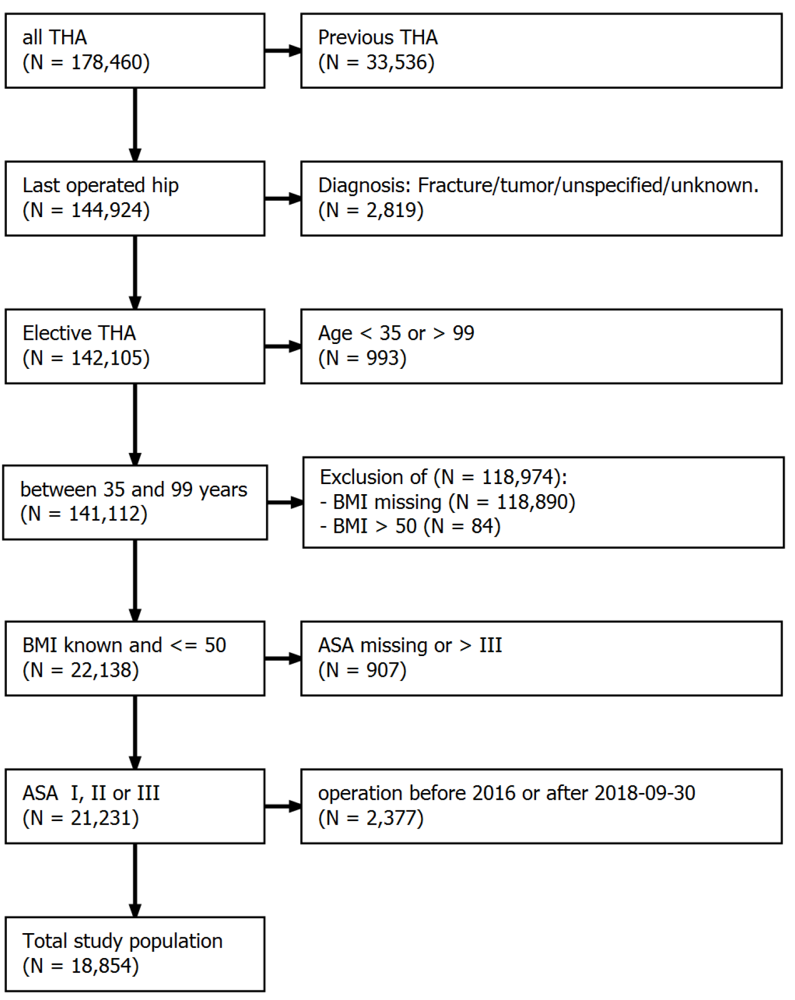
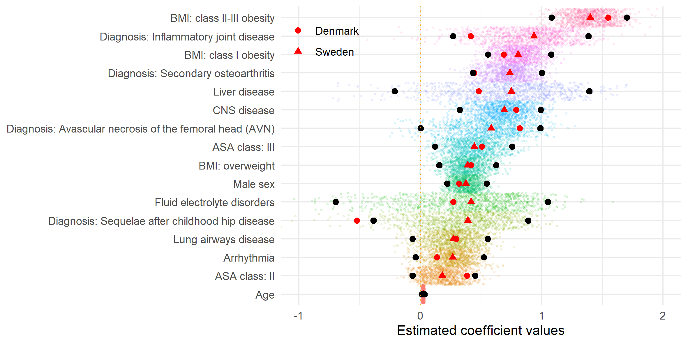

```{r setup, include = FALSE}
options(
  digits         = 2,
  knitr.kable.NA = '',
  repos          = list(CRAN = "https://cran.rstudio.com/")
)

knitr::opts_chunk$set(
  echo       = FALSE,
  out.width  = "100%", 
  out.height = "100%"
)

library(tidyverse)

nmbr <- function(x) format(as.numeric(trimws(as.character(x))), big.mark = ",") 

# Pre-load all cached files < 10 MB
cache_files <- dir("../cache", ".RData", full.names = TRUE)
filesizes <- do.call(file.size, list(cache_files)) / 2^20
Vectorize(load, "file")(cache_files[filesizes < 10], .GlobalEnv)
```

1.  The Swedish Arthroplasty Register, Gothenburg, Sweden
2.  Department of Orthopaedics, Institute of Clinical Sciences, The Sahlgrenska Academy, University of Gothenburg, Gothenburg, Sweden
3.  Department of Clinical Epidemiology, Aarhus university hospital, Aarhus, Denmark
4.  Department of Mathematics, Aarhus University
5.  Department of Clinical Medicine, Aarhus university
6.  Department Surgical Sciences/Orthopaedics, Uppsala University Hospital, Uppsala, Sweden

- EB: Statistician, MSc, PhD, erik.bulow@gu.se
- IT: Statistician, MSc, PhD, ita@clin.au.dk
- UH: Biostatistician, PhD, associate professor, ute@math.au.dk
- OR: Orthopaedic consultant, PhD, professor, register director, ola.rolfson@gu.se
- ABP: Orthopaedic consultant, PhD, DMSc, professor, abp@clin.au.dk
- NPH: Orthopaedic consultant, PhD, professor, nils.Hailer@surgsci.uu.se

**Correspondence:** [erik.bulow@gu.se](mailto:erik.bulow@gu.se); +46 70 08 234 28; The Swedish Arthroplasty Register, Registercentrum Västra Götaland, SE-413 45, Sweden

**Guarantor:** NPH, as the principal investigator, affirms that this manuscript is an honest, accurate, and transparent account of the study being reported; that no important aspects of the study have been omitted; and that any discrepancies from the study as planned have been explained.

**Word count:** 3,583

##### PAGE BREAK

```{r}
# Participants and methods --------------------------------------------
N_shar <- 
  table1 %>% 
  filter(what == "Total") %>% 
  select(`SE Total`) %>% 
  pluck(1)

N_dk <- 
  table1 %>% 
  filter(what == "Total") %>% 
  select(`DK Total`) %>% 
  pluck(1)

period <- paste(range(df$P_SurgYear), collapse = "-")


# Results -------------------------------------------------------------
crude_rate <- sum(df$outcome) / nrow(df)

get_auc <- function(model, version = "1", Country = "Sweden") {
  data_auc_ci %>% 
  filter(Model == model, country == Country) %>% 
  select(ends_with(version)) %>% 
  pluck(1)
}
dkauc <- function(model) {
  sub("AUC = ", "", get_auc(model, "2", Country = "Denmark"))
}
```

# Abstract

**OJECTIVE:** We developed a parsimonious prediction model for prosthesis joint infection (PJI) within 90 days after total hip arthroplasty (THA).

**DESIGN:** Logistic LASSO regression with bootstrap ranking applied to prospectively collected patient data from multiple linked national registers. 

**SETTING:** Model derivation and internal (external) validation for all hospitals performing THA in Sweden (Denmark).  

**PARTICIPANTS:** `r nmbr(N_shar)` patients from the Swedish Hip Arthroplasty Register with elective THA 2008-2015, and `r nmbr(N_dk)` patients from the Danish Hip Arthroplasty Register with THA 2016--September 2018. 

**MAIN OUTCOME MEASURE:** PJI as identified either as reason for re-operation, or as recorded by ICD-10 or NOMESCO codes at later hospital visits.

**RESULTS:** Incidence of PJI was `r crude_rate * 100` %  in Sweden and 2.17 % in Denmark. A model with the `r coefs_text[["long"]]`, had an `r get_auc("Reduced model (SE)", "2")` in Sweden, and `r sub("^AUC = ", "", get_auc("Reduced model (SE)", "2", Country = "Denmark"))` in Denmark. This was superior to traditional models based on ASA class, Charlson, Elixhauser, or the Rx Risk V comorbidity indices. Internal calibration was good for predicted probabilities up to 10 %.

**CONCLUSION:** Our model, based on easily accessible data available before THA, had superior discriminatory ability compared to ASA class alone or more complex comorbidity indices. It had good calibration and was externally validated in Denmark. We provide a web-based calculator (https://erikbulow.shinyapps.io/thamortpred/) to enable shared decision making by patients and surgeons. 

##### PAGE BREAK


# Summary box

## What is already known on this topic

- Periprosthetic joint infection (PJI) is the most devastating of early complications after total hip arthroplasty (THA).
- Attempts have been made to develop individualized risk prediction models for clinical usage in the US and Australia.
- None of those models have gained general acceptance due to limited samples, low discriminating ability, sub-optimal calibration or absence of external model validation. 

## What this study adds
- Our model, based on easily accessible data available before THA, had superior discriminatory ability compared to more complex comorbidity indices. 
- Our model had good calibration, was externally validated in Denmark, and can be used in clinical practice by a simple web calculator (https://erikbulow.shinyapps.io/thamortpred/).


##### PAGE BREAK

# Introduction

Periprosthetic joint infection (PJI) is the most devastating of early complications after total hip arthroplasty (THA), mainly due to its association with increased mortality, re-operation risk, long-term antibiotic treatment, and often persistently impaired quality of life.[@Zimmerli2006; @Kapadia2016; @Shohat2019] Many risk factors for the development of PJI are identified, with anaemia, diabetes, and obesity being important, to some extent modifiable risk factors, whereas advanced age and male sex are examples of non-modifiable risk factors.[@Ridgeway2005; @Lai2007; @Malinzak2009; @Ong2009; @Pedersen2010; @Bozic2012; @Jamsen2012; @Rasouli2014a; @Maoz2015] Individualized PJI risk stratification would be a highly relevant tool in the pre-operative assessment of patients scheduled for THA. Both the American Society for Anesthesiologists' (ASA) classification or considerably more complex comorbidity indices can be used for risk profiling, but their use is rather challenging. Although high ASA class is a risk factor for worse clinical outcomes, it was never developed for the purpose of predicting PJI [@Haynes1995; @Berbari2012]. The Charlson[@Charlson1987] and Elixhauser[@Elixhauser1998] comorbidity indices are based on `r nrow(coder::charlson)` or `r nrow(coder::elixhauser)` conditions according to the International Classification of Diseases (ICD), respectively, but they are cumbersome to use in a clinical setting, and they were also not designed for prediction of specific adverse events after THA. The same is true for the Rx Risk V-classification with `r nrow(coder::rxriskv)` conditions codified along the Anatomical Therapeutic Chemical (ATC) Classification.[@Sloan2003; @Pratt2018] Several attempts have been made at developing prognostic individualized risk prediction models for clinical usage, with the Universal American College of Surgeons National Surgical Quality Improvement Program (ACS NSQIP) Surgical Risk Calculator being one of the first.[@Edelstein2015; @Wingert2016a] Additional models have since been derived on US or Australian cohorts, but none has gained general acceptance.[@Wingert2016a; @Bozic2013a; @Inacio2015a] This is mainly due to often limited, sometimes single-center based samples, low discriminating ability or sub-optimal calibration of the prediction models, or the absence of external model validation. We therefore aimed to develop a prognostic prediction model of PJI within 90 days after THA that is based on easily accessible data that are available in the setting of clinical decision-making. Furthermore, we aimed to validate the model both internally in Sweden, as well as externally on a Danish national cohort.


# Patients and Methods

We used data from the Swedish Hip Arthroplasty Register (SHAR) for model derivation and internal validation of discrimination and calibration. The best model was then validated externally on a cohort from the Danish Hip Arthroplasty Register (DHR). We followed the TRIPOD checklist for the reporting of the study.


## Derivation cohort (Sweden)

The derivation cohort was obtained from SHAR `r period`, with the choice of 2008 as the starting year because registration of ASA class and body mass index (BMI) was initiated then. Deterministic data linkage was achieved by using personal identity numbers that are assigned to all Swedish residents at birth or immigration.[@Ludvigsson2009; @Cnudde2016] The diagnosis underlying the index THA procedure (categorized into `r glue::glue_collapse(tolower(levels(df$P_DiaGrp)), ", ", last = " and ") %>% {gsub("\\(avn\\)", "[AVN]", .)}`), type of THA fixation (cemented or uncemented stem and cup respectively), age at index surgery, sex, BMI prior to surgery, ASA class at the time of surgery, type of hospital, and year of surgery, were obtained from the SHAR. Data on comorbidities recognized during one year prior to index surgery, were obtained from the National Patient Register (NPR) where diagnoses based on in- and outpatient episodes in all private and public hospitals are coded according to ICD-10 together with admission and discharge dates. Data on marital status and the educational level of patients was obtained from the longitudinal integration database for health insurance and labour market studies (LISA) from Statistics Sweden. The SHAR has completeness of 96-98 % and 100 % coverage (82 hospitals in 2020),[@Karrholm2018] the LISA has coverage of 98 % with 85 % accuracy, and completeness for the NPR is above 99 % and the positive predictive value is 85-95 %.[@Ludvigsson2011] Death dates were linked from the national population register. Only the last operated hip was considered for patients with bilateral THA.[@Bulow2020] Patients with missing information on ASA class, or an ASA class of IV and above, were excluded, as were patients with missing information on BMI or a measurement above 50. Patients with missing information on educational levels or the type of hospital performing index surgery were also excluded, as were children under the age of 18.


## External validation cohort (Denmark)

Danish THA patients were operated from 2016 until the last of September 2018. This period was chosen due to availability of ASA and BMI data and possibility for all patients to have 90 days of follow up.

All surgery related variables, ASA and BMI were obtained from the DHR. The DHR is a clinical quality database established in 1995 on all primary and revision THA surgeries, with registration completeness of more than 95 % during the last decade for both primary and revision THAs.[@Gundtoft2016] All hospitals performing THA in Denmark (40 in 2019) are included in the register. 
The Danish National Patient Register holds data on ICD-10 codes as well as all procedures codes for hospitalizations and outpatient visits at Danish public and private hospitals.[@Schmidt2015] Data on education and civil status were obtained from Statistics Denmark.[@zotero-2587]

Similar exclusion criteria were applied for diagnosis, ASA class, BMI and bilateral prosthesis. Education and type of hospital were not used in the final model and therefore not required for the Danish patients. Most people in the Swedish cohort were of age 35 to 99. We therefore chose to validate the model for this age group only.


## Definitions of covariates and outcomes

The Charlson and Elixhauser comorbidity indices are based on the presence of ICD-10 codes grouped into `r nrow(coder::charlson)` and `r nrow(coder::elixhauser)` categories each.[@Quan2005] Such codes were identified from reported in- and outpatient hospital visits recorded in the national patient registers during one year prior to surgery. Diagnostic categories from those indices were combined to define `r nrow(tab_categorization)` categories of comorbidity that were chosen in order to be easily identifiable in a clinical setting (Tab. \@ref(tab:tabcategorization)). 

```{r tabcategorization}
load("../cache/tab_categorization.RData")

tab_categorization %>%
  ungroup() %>% 
  mutate(
    `Comorbidities by groups` = 
      gsub("Heart infarct", "Myocardial infarction", `Comorbidities by groups`)
  ) %>% 
  knitr::kable(
    caption = "Categorization of comorbidities from the Charlson and Elixhauser  comorbidities. (CNS = central nervous system.)")

```

Some of the combined comorbidities were observed for less than 10 patients with or without PJI, and these diagnoses were not considered as potential predictors to reduce the risk of overfitting the model to spurious events. 

PJI was defined by the occurrence of relevant ICD-10 or procedural Nordic Medico-Procedural Committee (NOMESCO)-codes recorded in the national patient registers for hospital visits within 90 days of THA (Tab. \@ref(tab:infcodes)), or if the patient was reported to SHAR or DHR as re-operated due to infection within the same time frame.

```{r infcodes}
library(coder)

icd10_codes <- 
  summary(
      hip_ae_hailer, 
      "icd10se", 
      cc_args = list(regex = "icd10", stop = TRUE)
    )$codes_vct$Infection %>% 
    paste(collapse = ", ")

nomesco_codes <- 
  summary(
      hip_ae_hailer, 
      "kva", 
      cc_args = list(regex = "kva", stop = TRUE)
    )$codes_vct$Infection %>% 
    paste(collapse = ", ")

tibble(
  classification = c("ICD-10", "NOMESCO"),
  codes = c(icd10_codes, nomesco_codes)
) %>% 
  knitr::kable(
    caption = "Codes identifying PJI if recorded in the Swedish and Danish National Patient Registers within 90 days after THA."
  )

```


## Model development

Model development was performed by bootstrap ranking and a logistic least absolute shrinkage and selection operator (LASSO).[@Guo2015; @Baranowski2020; @Garland2021] Age was normalized prior to modelling, and the estimated coefficients thus indicated variable importance on the same scale as categorical variables. BMI was divided into four categories based on the six intervals proposed by the World Health Organization (WHO; BMI $<25$: under- or normal weight, $25-29.9$: overweight, $30-34.9$: class I obesity, and BMI $\geq 35$: class II-III obesity).

Ten-fold cross validation was performed with a range of potential penalty values ($\lambda_i$:s) in the LASSO model, keeping the $\lambda$ that minimized the mean cross-validated deviance. 100 bootstrap samples were then drawn from the observed data set.[@Austin2004]

Logistic LASSO regression was performed for each sample using the chosen $\lambda$ as penalty term. Regression coefficients were ranked based on their absolute values as a measure of variable importance. We then used Bayesian methods to estimate a posterior distribution and to identify two change points in a linear segmented piecewise regression model. The second change point was then used as a break-point. Influential predictors with absolute coefficients value above this point scored a point and the entire process was repeated 100 times, yielding 10,000 bootstrap samples in total. Potential predictors that were selected at least `r brlasso_selection_n["main"]` out of 100 times were then used in a main effects multivariable logistic regression model without penalty and without pre-normalization of age. An even more parsimonious "reduced" model with potential predictors chosen at least `r brlasso_selection_n["reduced"]` out of 100 times was evaluated for comparison. Odds ratios for the final models were estimated with 95 % confidence intervals based on the whole derivation cohort.


## Reference models

Univariable prediction models based on either ASA class, the Charlson, Elixhauser, or the Rx Risk V comorbidity indices were fitted for comparison, as well as multivariable models combining those measures with age, sex and BMI (10 models in total). The Rx Risk V index is a comorbidity index based on medical prescriptions coded by the Anatomical Therapeutic Chemical (ATC) classification system during one year prior to surgery. This data was retrieved from the Swedish and Danish[@Kildemoes2011] national prescription registers and classified according to Pratt et al.[@Pratt2018] 


## Model validation

The main, reduced and the 10 reference models were used to predict the probability of PJI within 90 days for patients derived from the SHAR (internal validation). Receiver operating characteristic (ROC) curves and their corresponding areas under the curve (AUC) were used to describe discrimination with 95 % confidence intervals based on an asymptotic approximation suggested by DeLong et al.[@DeLong1988] The bias-corrected Somers' $D_{xy}$ rank correlation based on 100 resamples was used to adjust for optimism, but the correction for optimism only affected the third decimals in the presented results, and will therefore not be further discussed. Predicted probabilities and observed proportions were plotted with 95 % confidence intervals to graphically assess model calibration.[@Nattino2016] Coefficients of determination were estimated by Nagelkerke's $R^2$ for each model. The baseline model with the lowest $R^2$ ($R^2_0$) was compared to the other $k = 1, \ldots, 11$ models, by $1 - R^2_0 / R^2_k$. This is the fraction of new information, or the proportion of added explainable variation for model $k$ compared to baseline.[@Harrell2018]

The derived model was then externally validated on the Danish cohort, both with the coefficient estimates from the Swedish cohort and with new estimates based on the Danish cohort. The 10 reference models, with adopted coefficient estimates, were also applied to the Danish cohort for comparison. Finally, the new coefficient estimates for the derived model, re-estimated with Danish data, were empirically compared to analogues estimates derived from subsamples of the Swedish data with sample sizes to match the Danish cohort (supplementary, Tab \@ref(tab:comparecoefs) and Fig. \@ref(fig:coefsspread)).


## Statistical tools

We used `r R.version.string` (R Foundation for Statistical Computing, Vienna, Austria) with significant packages coder,[@Bulow2020b] decoder, furrr, pROC, rms, tidymodels and tidyverse. We build a shiny-based web calculator to aid clinical usage (https://erikbulow.shinyapps.io/thamortpred/).


## Patient and Public Involvement

Patient representatives are elected as ordinary members of the steering committees for SHAR and DHR, where the development of shared decision making has been discussed. Our web calculator will be available for (potential) patients and the public.


## Ethical approval

Ethical approval for this study was obtained from the Regional Ethical Review Board in Gothenburg (360-13). The study was approved by the Danish Data Protection Agency (journal number 2015-57-0002) and recorded at Aarhus University (journal number 2016-051-000001).


# Results

```{r}
age <- sprintf("%.0f (SD = %.0f)", mean(df$P_Age), sd(df$P_Age))

comorb <- function(x) {
  sprintf("%.0f %% (n = %s)", mean(x) * 100, nmbr(sum(x)))
}
```


## Study participants

We included `r nmbr(N_shar)` patients (`r round(mean(df$P_Sex == "Male") * 100)` % males) with a mean age of `r age` years in the derivation cohort from the SHAR (Fig. \@ref(fig:flowchartse)). `r crude_rate * 100` % (n = `r format(sum(df$outcome), big.mark = ",")`) of these developed a PJI within 90 days (Tab. \@ref(tab:tab1)). The proportion of patients with ASA class III was `r comorb(df$P_ASA == "III")`; `r comorb(df$CCI_index_quan_original > 0)` had at least one comorbidity according to the Charlson comorbidity index, `r comorb(df$ECI_index_sum_all > 0)` according to Elixhauser index, and `r comorb(df$Rx_index_pratt > 0)` had medications classified according to Rx Risk V. 

In addition, `r nmbr(N_dk)` patients (42.1 % males) with a mean age of 70 (SD = 11) years were included in the external validation cohort (Fig. \@ref(fig:flowchartdk)). 2.2 % (n = 410) of these developed a PJI within 90 days (Tab. \@ref(tab:tab1)). The proportion of patients with ASA class III was 18 % (n = 3,334); 14 % (n = 2,722) had at least one comorbidity according to the Charlson comorbidity index, 22 % (n = 4,101) according to Elixhauser index, and 56 % (n = 10,625) had medications classified according to Rx Risk V.


```{r tab1, warning=FALSE}
source("../lib/clean_names.R")

table1 %>% 
  mutate(
    what = replace(what, duplicated(what), "")
  ) %>% 
knitr::kable(
  caption = "Patient characteristics in Sweden 2008-2015 and Denmark 2016 to September 2018. Educational levels were classified as low (up to 9 years), middle (10-12 years) and high (more than 12 years). Data on hospital levels were not available for the Danish cohort. Some additional cells have been intentionally left blank due to small numbers and privacy concerns for the Danish cohort. BMI = Body mass index. ASA class = American Society for Anaesthesiologists classification. CNS = central nervous system.") 
```


## Model development and internal validation

Patients with `r excl_factors` were uncommon, why these comorbidities were excluded as potential predictors prior to further modelling. 

Results from the 100 bootstrap replicates for variable selection were mostly coherent. Diagnosis, BMI and some comorbidities where selected each time. Age was selected 82 out of 100 times, but some factors, such as civil status and type of hospital, were only sporadically selected (Tab. \@ref(tab:brlprop)).    


```{r brlprop}
coefs_selected_tab %>% 
knitr::kable(
  caption = "Variables selected by the bootstrap ranking procedure. Variables selected at least 10 out of 100 times were used in the main model. Variables chosen at least 80 times were kept in the reduced model as well. (BMI = body mass index. ASA class = American Society for Anaesthesiologists classification. CNS = central nervous system.)")
```

The reduced model (variables with $n \leq 80$ in Tab. \@ref(tab:brlprop)) included `r coefs_text[["short"]]` with estimated coefficient values in Tab. \@ref(tab:coefs).

```{r coefs}
tbl_coefs_present %>% 
  mutate(
    beta = round(beta, 2)
  ) %>% 
knitr::kable(
  caption = 'Estimated coefficients (beta) and odds ratios (OR) with 95 % confidence intervals for the reduced models. BMI = body mass index (under/normal weight as baseline). CNS = central nervous system. ASA = American Society for Anesthesiologists'
)
```

ROC-curves and AUC-values for the main and reduced models were very similar, and for simplicity, we therefore focused on the reduced model.

```{r}
CCI_AUC <- sub("AUC = ", "", get_auc("Charlson"))
CCI_R2 <-
  tab_new_info %>% 
  subset(Model == "Charlson", "R2 (%)", drop = TRUE)
red_FNI <- 
  tab_new_info %>% 
  subset(Model == "Reduced model", "FNI (%)", drop = TRUE) %>% 
  round()
```

The reduced model had an `r get_auc("Reduced model (SE)", "2")`, whereas univariable models with ASA class `r get_auc("ASA")`, the Charlson comorbidity index `r get_auc("Charlson")`, the Elixhauser comorbidity index `r get_auc("Elixhauser")`, and Rx Risk V `r get_auc("Rx Risk")` had less discriminatory abilities (Fig. \@ref(fig:rocs) left panel and \@ref(fig:aucci) left panel). The univariable model with the Charlson comorbidity index had the lowest AUC and Nagelkerke's $R^2 = $ `r CCI_R2`, and compared to this model, the fraction of new information for the reduced model was `r red_FNI` % (Tab. \@ref(tab:fni)).

```{r fni}
tab_new_info %>% 
  arrange(desc(`R2 (%)`)) %>% 
knitr::kable(
  caption = "Model performance based on the Swedish derivation cohort. The area under the receiver operating characteristics curve (AUC) is a measure of discriminatory ability. Nagelkerke's pseudo-coefficient of determination (R2) is an estimate of the proportion of explained variance for each model (the correlation between observed and predicted values). The univariable Charlson model had the lowest R2 and was therefore used as baseline for the fraction of new information (FNI) added by the other models.")
```

The reduced model had good internal calibration for predictions up to 10 % (Fig. \@ref(fig:calibration)). Estimated probability density curves for patients with and without PJI were partially overlapping, but patients with PJI had on average higher predicted probabilities for this outcome (Fig. \@ref(fig:sep)).


## External validation

The reduced model derived from the Swedish cohort produced a very similar ROC curve when applied to the Danish cohort (Fig. \@ref(fig:rocs) right panel), and its AUC value was 0.66 (95% CI: 0.64 to 0.69). This did not change for the model with re-estimated coefficient values based on the Danish cohort (0.67, 95 % CI: 0.65 to 0.7). AUC values for some of the reference models, estimated on the Danish cohort, did differ from the Swedish cohort, but all those models were less accurate (had broader 95 % CIs) than the reduced model (Fig. \@ref(fig:aucci) right panel). The re-estimated model coefficients of the reduced model were coherent with the estimates based on the Swedish data (supplementary Tab. \@ref(tab:comparecoefs)).

Calibration was good for predictions up to 3 %, with some tendency to over-estimating higher probabilities, which improved after initial re-calibration of the model intercept to the Danish PJI incidence (Fig. \@ref(fig:calibration)).


# Discussion

## Principal findings

A model based on `r coefs_text[["short"]]` was better at predicting PJI within 90 days after THA than models based on either ASA class or the Charlson, Elixhauser or Rx Risk V comorbidity indices, with or without adjustments for age and sex, in terms of AUC, Nagelkerke's $R^2$ and calibration. 


## Strengths and weaknesses

Our external validation is a strength, which showed that the model works equally well in Denmark, despite some perceived differences between the countries, partially explained by different coding routines in each country (Tab. \@ref(tab:tab1)). 

Both Sweden and Denmark have strived for mass higher education.[@Isopahkala-Bouret2018] This is, to a higher degree achieved via the university sector in Sweden, while the educational system is more diverse in Denmark.[@Kim2002] National comparisons of educational levels are therefore difficult, since the Danish student register does not include adult- or continuing education.[@zotero-2598] Patient distribution among ASA classes were similar in both countries, but the comorbidity burden seems to differ. ICD-10 and NOMESCO codes are recorded for both in- and outpatient hospital visits in the national patient registries in both countries, but the recording of (optional) secondary diagnoses is 23 % in Denmark,[@Schmidt2015] compared to 47 % in the Swedish cohort. Serious comorbidities such as cancer, are therefore reported equally in both countries, while for example arterial hypertension, is less documented in Denmark. Also, patients with chronic conditions, such as diabetes, are more commonly treated in primary care settings in Denmark, and are therefore less reported to their national patient register.[@Schmidt2015] The RxRisk V index is a weighted index, which is difficult to compare without further analysis. Prescription patterns might differ by indications based on different national guidelines, different subsidization, and different medications sold over-the-counter. Also, the Danish, but not the Swedish, national prescription register, includes prescriptions from nursery homes and other long-term care facilities. Taken together, the similarities between the countries might be bigger than perceived by Tab. \@ref(tab:tab1).

However, the difference in mode of fixation, with a dominance of cemented components in Sweden, is real, and has been described elsewhere.[@Bunyoz2020]


## Strengths and weaknesses in relation to other studies

Cancer seems to confer an increased risk of PJI in several observational studies,[@Bozic2012; @Everhart2013; @Poultsides2013; @Wingert2016a] but this comorbidity was not included in our model. It nevertheless appeared in `r subset(coefs_selected_tab, variable == "Cancer", "n", drop = TRUE)` of the 100 bootstrap replicates (Tab. \@ref(tab:brlprop)), and could have been included in a less parsimonious model. Neither diabetes was included in our model, but has been in previous risk calculators.[@Wingert2016a; @Tan2018; @Inacio2015] On the other hand, diabetes is not consistently found to be associated with the risk of surgical site infection or PJI after THA surgery.[@Namba2012] 

Information on peri-operative hyperglycaemia, morning blood glucose, HBA1c,[@Mraovic2011; @Iorio2012] or low preoperative haemoglobin,[@Rasouli2014a] could have improved our model. But although we had access to the ICD codes defining the presence of anaemia, we had no information on actual laboratory findings. Use of subcutaneously applied Tumour Necrosis Factor-alpha blockers,[@Gilson2010; @Momohara2011] intra-articular steroid application[@Cancienne2015] or operating time,[@Maoz2015; @Willis-Owen2010; @Berbari2012] are also associated with the risk of PJI after THA. However, we chose to only consider factors available before surgery and are thus able to use the model as a tool for shared decision making using the implemented web calculator. This is a strength of our model. 

We also confirmed that, although mentioned as risk factors for surgical site infections after joint arthroplasty,[@Rasouli2014a; @Inacio2015a] prediction models based on the comorbidity indices developed by Charlson or Elixhauser and the RxRisk V index, resulted in poor predictive power. This agrees with previous findings describing that these measures of comorbidity rather poorly predict mortality and patient reported outcomes after THA.[@Bulow2017; @Bulow2019] However, when used in conjunction with information on age and sex, the AUC for these comorbidity indices increased, although never quite reaching the AUC of our model (Fig. \@ref(fig:aucci) and Tab. \@ref(tab:fni)).


## Meaning of the study

Our model can be presented in a simple formula $\hat p = 1/[1 + \mathrm{exp}(-\hat \alpha - x'\hat \beta)]$ where $\hat p$ is the estimated probability, $\hat \alpha$ and $\hat \beta = (\hat\beta_1, \hat\beta_2, \ldots, \hat\beta_k)$ are the estimated intercept and coefficients (Tab. \@ref(tab:coefs)) and $x = (x_1, x_2, \ldots, x_k)$ are corresponding patient characteristics. For example, `r examples$desc[[1]]` would have a probability of $1/[1 + \mathrm{exp}(6.31 - 60\cdot0.02)] \approx$ `r examples$p[[1]]` of suffering from a PJI within 90 days, whereas `r examples$desc[[2]]` would have a probability of `r examples$p[[2]]`. Note, however, that observed proportions above 10 % were rare, and predicted probabilities above this limit are subject to extrapolation.

It should be noted that the aim of prediction is different from statistical inference. As such, confidence intervals presented for the model coefficients (Table \@ref(tab:coefs)) were based solely on the final logistic regression model. Additional uncertainty introduced by the variable selection process was not incorporated. Hence, those intervals should not be interpreted in support of any implicit hypothesis testing concerning the relevance of any individual variable. Also, the individual odds ratios should not be interpreted as effect measures of individual relations since some variables are correlated.

The selected variables are nevertheless coherent with previous studies. Patients with primary osteoarthritis seem less prone to developing PJI than patients receiving THA for other reasons.[@Pedersen2010a; @Dale2012; @Bozic2012; @Inacio2015a] Obesity is associated with an increased risk of reoperations or adverse events after THA[@Sayed-Noor2019] and with an increased risk of developing surgical site infections or PJI after total hip or knee arthroplasty.[@Malinzak2009; @Jamsen2012; @Maoz2015; @Everhart2013; @Tan2018] CNS disease (cerebrovascular disease, dementia, hemiplegia, and Parkinson's disease) has also been previously associated with PJI,[@Bozic2012] as have male sex,[@Dale2012; @Wingert2016a; @Tan2018] liver disease [@Deleuran2015] and ASA class.[@Berbari2012; @Pulido2008; @Namba2012] 

THA fixation using cement without antibiotics confers an increased risk of PJI,[@Dale2012] but such cement brands were not in clinical use in Sweden during the studied period. We found no indication that the type of fixation was associated with the risk of PJI, and the mode of THA fixation was also not selected as a potential predictor variable in any of the iterations during model development.


## Unanswered questions and future research

The proportion of explained variation (Nagelkerke's $R^2$ = `r subset(tab_new_info, Model == "Reduced model", "R2 (%)", drop = TRUE)` %) was low. The question of what other variables might be needed to further refine prediction models remains open, but information that is notoriously difficult to obtain within the setting of large register studies, such as smoking status, might be of value. In addition, a potential underlying susceptibility to PJI -— as has been described for patients with osteomyelitis -— could be a factor of considerable influence on the outcome, but information on single nucleotide polymorphisms in genes that have been associated with musculoskeletal infections was unavailable to us. Such shortcomings could be addressed by future genome-wide association studies.


## Conclusion

Our results indicate that the risk of early PJI after THA can be pre-operatively assessed by a parsimonious prediction model. We hope that this model, with its accompanying web calculator, will facilitate shared decision-making between physicians and their patients in need of THA.


##### Page break

# Contribution of authors

NPH initiated the study. OR managed the ethical review board application in Sweden and ABP in Denmark. EB developed the statistical model. IT and UH performed the external validation. NPH and EB drafted, and all authors edited and finalized the manuscript.


# Acknowledgement

We would like to thank Aurelie Mailhac, statistician at the Department of Clinical Epidemiology at Aarhus university, for help with the external validation.


# Data sharing

Access to the model derivation cohort is granted after permission from the Västra Götaland Region, as the central personal data controller agency for the SHAR, in accordance with the European General Data Protection Regulation (GDPR), as well as Swedish laws and regulations (https://registercentrum.se/vara-tjaenster/datauttag/p/B1eeV66QE).


# Disclosure

All authors have completed the ICMJE uniform disclosure form at http://icmje.org/downloads/coi_disclosure.docx and declare: no support from any organisation for the submitted work; OR is principal investigator for research partly founded by Pfizer; OR is register director of the Swedish Arthroplasty Register (SAR) and board member of the International Society of Arthroplasty Registries; NPH has received institutional support from Waldemar Link GmbH, and Zimmer Biomet; NPH is president of the Nordic Arthroplasty Register Association, member of the steering committee of SAR, and Co-Editor of Acta Orthopaedica; no other relationships or activities that could appear to have influenced the submitted work.


##### PAGE BREAK

<!-- FIGURES -->

```{r}
# MOve figure file to folder for easy access
fc <- 0 # Figure count

cp_fig <- function(file) {
  fc <<- fc + 1
  x <- file.copy(file, paste0("bmj_figs/", fc, ".pdf"), TRUE)
}
```


```{r flowchartse, fig.cap = "Flowchart with inclusion criteria and number of patients. Data from the Swedish Hip Arthroplasty Register were used for model derivation and internal validation"}

cp_fig("../graphs/flowchart.pdf")
knitr::include_graphics("../graphs/flowchart.png")
```

```{r flowchartdk, fig.cap = "Flowchart with inclusion criteria and number of patients. Data from the Danish Hip Arthroplasty Register were used for external model validation."}

cp_fig("../validation/flowchartdk_detailed.pdf")

```

##### PAGE BREAK

```{r rocs, fig.cap = "Receiver Operation Characteristics (ROC) curves combines sensitivity and specificity to illustrate discriminative abilities of the different models. The main and reduced models performed almost identical for prediction of PJI within 90 days after surgery. They both performed better than all other models (left panel). The reduced model performed as well when applied to the Danish validation cohort (right panel)."}

cp_fig("../graphs/roc.pdf")
knitr::include_graphics("../graphs/roc.png")
```

##### PAGE BREAK

```{r aucci, fig.cap = "Area Under the Receiver Operation Characteristics Curve (AUC) as a measure of predictive discriminative ability with 95 % confidence intervals (De-Long). The reduced model performed no different than the main model on the Swedish data, and both of these models performed better than all other models (left panel). Similar models were fitted to the Danish cohort (right panel). Coefficient values based on the Swedish data, Reduced model (SE), performed almost as good as the reduced model (DK) with coefficient values refitted to the Danish cohort."}

cp_fig("../graphs/auc_ci.pdf")
knitr::include_graphics("../graphs/auc_ci.png")
```

##### PAGE BREAK

```{r sep, fig.cap = "Separation between patients with and without PJI within 90 days versus their predicted probabilities of this event. Most patients did not have PJI, wherefore the pink bars dominate the histogram (left panel; note the scales). A normalized density plot reveals, however, that patients with PJI had, on average, higher predicted probabilities for this adverse event (right panel)."}

cp_fig("../graphs/separation.pdf")
knitr::include_graphics("../graphs/separation.png")
```

##### PAGE BREAK

```{r calibration, fig.cap = "Calibration for the reduced model. Proportions of PJI above 10 % were rarely observed and therefore omitted. Internal calibration (green 95 % confidence band) is good; predicted probabilities are similar to observed proportions, as indicated by close proximity to the diagonal line. External calibration with the same model (pink) indicates some over-estimation and less accuracy. This is expected due to smaller sample size in the Danish cohort, and due to national differences. Calibration improves after re-calibration of the model intercept to better resamble the Danish base incidence (blue)."}

cp_fig("../graphs/calibration.pdf")
knitr::include_graphics("../graphs/calibration.png")
```


##### PAGE BREAK

# Supplementary

## Model coefficients

Variable selection and coefficient estimates were based on the Swedish cohort. 
The reduced model was then used to predict PJI also in Denmark. The coefficient values of the reduced model were also re-fitted to the Danish cohort for comparison. We compared the estimates from the Swedish and Danish cohorts and found most values to be of similar magnitude. The only coefficient with reversed direction was for patients with a diagnose of "sequelae after childhood hip disease". This is a rare condition, with very few observed PJI:s within 90 days. We also re-estimated the model coefficients 1,000 times based on the Swedish data. Each time, we took a random sample of the same size ($N = 18,854$) as was observed in the Danish cohort. The 2.5th and 97.5th percentiles were then used to form empirical 95 % confidence intervals for each coefficient (Tab. \@ref(tab:comparecoefs) and Fig. \@ref(fig:coefsspread)). The estimated effect of "sequelae after childhood hip disease" fall outside this empirical CI. Applying multiplicity correction by Bonferroni or similar, would eliminate this significance. Hence, it seems that both cohorts are similar in respect to association between the studied covariates and the risk of PJI within 90 days of THA.


```{r comparecoefs}
compare_se_dk_coefs %>% 
  rename(`95 % CI` = CI) %>% 
knitr::kable(
  caption = "Estimated coefficients for the reduced model based on the Swedish derivation cohort (Swedish), as well as re-estimated coefficient values based on the Danish cohort (Danish). Empirical confidence intervals (95 % CI) based on 1,000 resamples from the Swedish cohort of the same sample size (N = 18,854) as used in the Danish cohort. The Danish estimates fall within most of the CIs, indicating no support to reject the null hypothesis of no differneces between the countries."
)
```


```{r coefsspread, fig.cap = "Estimated coefficient values for the reduced model applied to the Swedish (red triangles) and Danish cohorts (red dots). Small coloured dots are empirical estimates from 1000 subsamples based on the Swedish data set, of the same sample size as used in the Danish validation cohort (outliers not shown). Black dots indicate the outer limits of 95 % empirical confidence intervals. The Danish estimates almost always fall within those CIs."}

cp_fig("../validation/Swedish_model.pdf")

```

##### PAGE BREAK

# Bibliography
