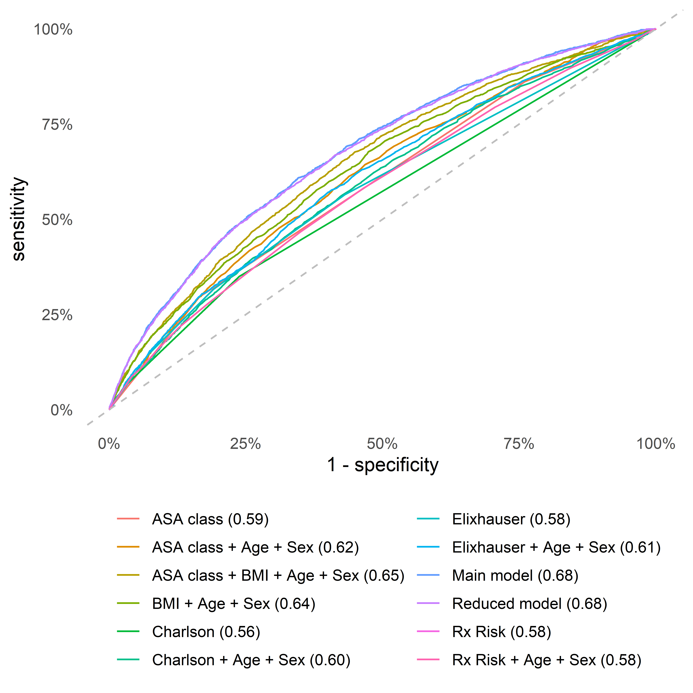

```{r setup, include = FALSE}
options(
  digits         = 2,
  knitr.kable.NA = '',
  repos          = list(CRAN = "https://cran.rstudio.com/")
)

knitr::opts_chunk$set(
  echo       = FALSE,
  out.width  = "100%", 
  out.height = "100%"
)

library(tidyverse)

nmbr <- function(x) format(as.numeric(trimws(as.character(x))), big.mark = ",") 

# Pre-load all cached files < 10 MB
cache_files <- dir("../cache", ".RData", full.names = TRUE)
filesizes <- do.call(file.size, list(cache_files)) / 2^20
Vectorize(load, "file")(cache_files[filesizes < 10], .GlobalEnv)
```

1.  The Swedish Arthroplasty Register, Centre of Registers Västra Götaland, Gothenburg, Sweden
2.  Department of Orthopaedics, Institute of Clinical Sciences, The Sahlgrenska Academy, University of Gothenburg, Gothenburg, Sweden
3.  Department of Clinical Epidemiology, Aarhus University Hospital, Aarhus, Denmark
4.  Department of Mathematics, Aarhus University, Aarhus, Denmark
5.  Department of Clinical Medicine, Aarhus University, Aarhus, Denmark
6.  Department of Surgical Sciences/Orthopaedics, Uppsala University Hospital, Uppsala, Sweden


**Corresponding author:** Erik Bülow; erik.bulow@gu.se; +46 70 08 234 28; The Swedish Arthroplasty Register, Centre of Registers Västra Götaland, SE-413 45 Gothenburg, Sweden

**Guarantor:** NPH, as the principal investigator, affirms that this manuscript is an honest, accurate, and transparent account of the study being reported; that no important aspects of the study have been omitted; and that any discrepancies from the study as planned have been explained.


##### PAGE BREAK

```{r}
# Participants and methods --------------------------------------------
N_shar <- 
  table1 %>% 
  filter(what == "Total") %>% 
  select(`SE Total`) %>% 
  pluck(1)

N_dk <- 
  table1 %>% 
  filter(what == "Total") %>% 
  select(`DK Total`) %>% 
  pluck(1)

period <- paste(range(df$P_SurgYear), collapse = "-")


# Results -------------------------------------------------------------
crude_rate <- sum(df$outcome) / nrow(df)

get_auc <- function(model, version = "1", Country = "Sweden") {
  data_auc_ci %>% 
  filter(Model == model, country == Country) %>% 
  select(ends_with(version)) %>% 
  pluck(1)
}
dkauc <- function(model) {
  sub("AUC = ", "", get_auc(model, "2", Country = "Denmark"))
}
```

# Abstract

**PURPOSE:** To develop a parsimonious risk prediction model for periprosthetic joint infection (PJI) within 90 days after total hip arthroplasty (THA).

**PATIENTS AND METHODS:** 
We used logistic LASSO regression with bootstrap ranking to develop a risk prediction model for PJI within 90 days based on a Swedish cohort of `r nmbr(N_shar)` patients with elective THA 2008-2015. 
The model was externally validated on a Danish cohort with `r nmbr(N_dk)` patients.

**RESULTS:** Incidence of PJI was `r crude_rate * 100` %  in Sweden and 2.17 % in Denmark. A model with `r coefs_text[["abstract"]]` had an area under the curve (AUC) of `r gsub("AUC = ", "", get_auc("Reduced model (SE)", "2"))` in Sweden and `r sub("^AUC = ", "", get_auc("Reduced model (SE)", "2", Country = "Denmark"))` in Denmark. This was superior to traditional models based on ASA class, Charlson, Elixhauser, or the Rx Risk V comorbidity indices. Internal calibration was good for predicted probabilities up to 10 %.

**CONCLUSION:** A new PJI prediction model based on easily accessible data available before THA, was developed and externally validated. The model had superior discriminatory ability compared to ASA class alone or more complex comorbidity indices and had good calibration. We provide a web-based calculator (https://erikbulow.shinyapps.io/thamortpred/) to facilitate shared decision making by patients and surgeons. 

**KEY WORDS:** Prediction model, total hip arthroplasty, orthopaedics, clinical decision-making tool, web calculator, external validation

##### PAGE BREAK


# Introduction

Periprosthetic joint infection (PJI) is one of the most devastating early complications after total hip arthroplasty (THA), mainly due to its association with increased mortality, re-operation risk, long-term antibiotic treatment, often persistently impaired quality of life, and socioeconomic consequences.[@Zimmerli2006; @Kapadia2016; @Shohat2019; @Malizos2016] Many risk factors for the development of PJI are identified, with anaemia, diabetes, and obesity being important, to some extent modifiable risk factors, whereas advanced age and male sex are examples of non-modifiable risk factors.[@Ridgeway2005; @Lai2007; @Malinzak2009; @Ong2009; @Pedersen2010; @Bozic2012; @Jamsen2012; @Rasouli2014a; @Maoz2015; @Lespasio2020; @Ren2021; @Resende2021; @Sodhi2020] 

Several attempts have been made at developing prognostic individualized risk prediction models for clinical usage, with the Universal American College of Surgeons National Surgical Quality Improvement Program (ACS NSQIP) Surgical Risk Calculator being one of the first.[@Edelstein2015; @Wingert2016a] Additional models have since been derived on US or Australian cohorts, but none has gained general acceptance.[@Wingert2016a; @Bozic2013a; @Inacio2015a] This is mainly due to often limited, sometimes single-center based samples, low discriminating ability or sub-optimal calibration of the prediction models, or the absence of external model validation. 

We therefore aimed to develop a prognostic prediction model of PJI within 90 days after THA, a commonly used period to clinically define early PJI.[@Lespasio2020] We based the model on easily accessible data that are available pre-operatively in the setting of clinical decision-making. Furthermore, we aimed to validate the model both internally in Sweden, as well as externally on a Danish national cohort.


# Patients and Methods

The derivation cohort was based on patients from an updated linkage database including the Swedish Hip Arthroplasty Register (SHAR). The included registers and linkage process has been described previously.[@Cnudde2016] We included all primary elective THAs performed in Sweden 2008-2015. Only the last operated hip was considered for patients with bilateral THA.[@Bulow2020] Patients with missing information on ASA class, or an ASA class of IV and above, were excluded, as were patients with missing information on BMI or a measurement above 50. Patients with missing information on educational levels or the type of hospital were also excluded, as were persons under the age of 18.

In addition to the Swedish derivation cohort, a Danish sample was used for external model validation. Danish THA patients were operated from 2016 until the last of September 2018. This period was chosen due to availability of information on ASA and BMI, and the possibility for all patients to have a minimum of 90 days of follow up. As in Sweden, data were linked from several national registers based on each patients unique identity number:[@Schmidt2014b] DHR as a quality register for THA,[@Gundtoft2016] the Danish National Patient Register with comorbidity data from all hospitals,[@Schmidt2015] and educational level and civil status from Statistics Denmark.[@zotero-2587] As patients with PJI in the Swedish cohort were of age 35 to 99 years, we chose to validate the model for this age span only.


## Definitions of covariates and outcomes

Comorbidities were first identified by ICD-10 codes from each countries' national patient register during the year before surgery. Individual conditions were grouped, first according to Elixhauser and Charlson, and then again into broader, clinically relevant, categories. Comorbidities observed for less than 10 patients with or without PJI, however,  were not considered as potential predictors, to reduce the risk of overfitting the model to spurious events. 

PJI was defined by the occurrence of relevant ICD-10 or procedural Nordic Medico-Procedural Committee (NOMESCO)-codes recorded in the national patient registers for hospital episodes within 90 days after THA (Table  \@ref(tab:infcodes)), or if the patient was reported to SHAR or DHR as re-operated due to PJI within the same time frame.


## Model development

We based a statistical variable selection procedure on bootstrap ranking combined with logistic least absolute shrinkage and selection operator (LASSO) regression, in a way previously described and illustrated by Garland et al.[@Garland2021] The distilled predictors were then used in a multiple main effects logistic regression model, our "main model". A more parsimonious "reduced model" was build by keeping only the most influential predictors. Those two models were then compared to univariable prediction models based on either ASA class, the Charlson, Elixhauser, or the Rx Risk V comorbidity indices,[@Kildemoes2011; @Pratt2018] as well as multivariable models combining those measures with age, sex and BMI.


## Model validation

Receiver operating characteristic (ROC) curves and their corresponding areas under the curve (AUC) were used to describe discrimination with 95 % confidence intervals (CI) for each model. Predicted probabilities and observed proportions were also plotted with 95 % confidence bands to graphically assess model calibration.[@Nattino2016] Coefficients of determination were estimated by Nagelkerke's $R^2$ for each model, as was the  fraction of new information for each model compared to the model with lowest $R^2$.[@Harrell2018] 

The model was externally validated on the Danish cohort, both with the coefficient estimates from the Swedish cohort, and with new estimates based on the Danish cohort. The reference models, with adopted coefficient estimates, were also applied to the Danish cohort for comparison.


## Statistical tools

We used R version 4.1 (R Foundation for Statistical Computing, Vienna, Austria) with significant packages coder,[@Bulow2020b] decoder, furrr, pROC, rms, tidymodels and tidyverse. We build a shiny-based web calculator to aid clinical usage (https://erikbulow.shinyapps.io/thamortpred/) and made all R scripts publicly available (https://doi.org/10.5281/zenodo.5914599).


## Ethical approval

Ethical approval for this study was obtained from the Regional Ethical Review Board in Gothenburg (360-13). The study was also approved by the Danish Data Protection Agency (journal number 2015-57-0002) and recorded at Aarhus University (journal number 2016-051-000001).


# Results

```{r}
age <- sprintf("%.0f (SD = %.0f)", mean(df$P_Age), sd(df$P_Age))

comorb <- function(x) {
  sprintf("%.0f %% (n = %s)", mean(x) * 100, nmbr(sum(x)))
}
```

We included `r nmbr(N_shar)` patients in the derivation cohort from Sweden (Figure \@ref(fig:flowchartse)). `r crude_rate * 100` % (n = `r format(sum(df$outcome), big.mark = ",")`) of these developed a PJI within 90 days. In addition, `r nmbr(N_dk)` patients were included in the external validation cohort from Denmark (Figure \@ref(fig:flowchartdk)). 2.2 % (n = 410) of these developed a PJI within 90 days (Table  \@ref(tab:tab1)). 

```{r}
CCI_AUC <- sub("AUC = ", "", get_auc("Charlson"))
CCI_R2 <-
  tab_new_info %>% 
  subset(Model == "Charlson", "R2 (%)", drop = TRUE)
red_FNI <- 
  tab_new_info %>% 
  subset(Model == "Reduced model", "FNI (%)", drop = TRUE) %>% 
  round()
```


ROC-curves (Figure \@ref(fig:rocs)) and AUC-values (Figure \@ref(fig:aucci)) were very similar for the main model and a reduced model, based on `r coefs_text[["short"]]`. For simplicity, we thus focused on the reduced model, with estimated coefficient values listed in Table \@ref(tab:coefs).

The univariable model with the Charlson comorbidity index had the lowest AUC and Nagelkerke's $R^2 =$ `r CCI_R2`, and compared to this model, the fraction of new information for the reduced model was `r red_FNI` % (Table  \@ref(tab:fni)). The reduced model had good internal calibration for predictions up to 10 % (Figure \@ref(fig:calibration)). Estimated probability density curves for patients with and without PJI were partially overlapping, but patients with PJI had on average higher predicted probabilities for this outcome (Figure \@ref(fig:sep)).

The reduced model derived from the Swedish cohort produced a very similar ROC curve when applied to the Danish cohort. Calibration was good for predictions up to 3 %, with a tendency to over-estimate higher probabilities, which improved after re-calibration of the model intercept to the Danish PJI incidence (Figure \@ref(fig:calibration)).


# Discussion

## Principal findings

We propose a PJI prediction model based on `r coefs_text[["short"]]`. This model was better at predicting PJI within 90 days after THA than models based on either ASA class or the Charlson, Elixhauser or Rx Risk V comorbidity indices, with or without adjustments for age and sex, in terms of AUC, Nagelkerke's $R^2$ and calibration. 


## Strengths and weaknesses

Our external model validation is a strength, supporting that the model works equally well in a different population. The validation was both geographical (different country) and temporal (different period). Discriminatory ability and calibration was good in the validation cohort despite apparent dissimilarities between the countries (Table \@ref(tab:tab1)). Some of the dissimilarities can partially be explained by different coding routines. ICD-10 and NOMESCO codes are recorded for both in- and outpatient hospital visits in the national patient registries in both countries, but the recording of (optional) secondary diagnoses is 23 % in Denmark,[@Schmidt2015] compared to 47 % in the Swedish cohort. Serious comorbidities such as cancer, are reported equally well in both countries, while for example arterial hypertension, is less well documented in Denmark. Also, patients with chronic conditions, such as diabetes, are more commonly treated in primary care settings in Denmark, and are therefore less well reported to the national patient register.[@Schmidt2015] The RxRisk V index is a weighted index, which is difficult to compare without further analysis. Taken together, the similarities between the countries might be more pronounced than indicated by Table \@ref(tab:tab1). However, the difference in the mode of THA fixation, with a dominance of cemented components in Sweden, and much more widespread usage of uncemented components in Denmark, is tangible and has been described elsewhere.[@Bunyoz2020]


## Strengths and weaknesses in relation to other studies

The standard peri-operative prophylaxis in THA surgery in Sweden is Cloxacillin (2g x 3) on the day of surgery. Those with confirmed or suspected allergy to Cloxacillin (roughly 10% of all patients) receive Clindamycin (600 mg x 2). This treatment might affect the outcome of interest, and therefore the possibility to generalize the results to countries with other treatment regimens.

Cancer seems to confer an increased risk of PJI in several observational studies,[@Bozic2012; @Everhart2013; @Poultsides2013; @Wingert2016a] but this comorbidity was not included in our model. Neither was diabetes included in our model, although it is included in previous risk calculators.[@Wingert2016a; @Tan2018; @Inacio2015] On the other hand, diabetes is not consistently found to be associated with the risk of surgical site infection or PJI after THA surgery.[@Namba2012] 

Information on peri-operative hyperglycaemia, morning blood glucose, HBA1c,[@Mraovic2011; @Iorio2012] or low preoperative haemoglobin,[@Rasouli2014a] could have improved our model. But although we had access to the ICD codes defining the presence of anaemia, we had no information on actual laboratory findings. Use of subcutaneously applied Tumour Necrosis Factor-alpha blockers,[@Gilson2010; @Momohara2011] intra-articular steroid application[@Cancienne2015] or prolonged operating time,[@Maoz2015; @Willis-Owen2010; @Berbari2012] are also associated with the risk of PJI after THA. However, we decided to only consider factors that are available in an out-patient setting prior to surgery and our model can thus be used as a tool for shared decision making. This is facilitated by use of the implemented web calculator which we believe is a strength of our model. Another strength is the closed form regression formula presented below which is more transparent than a black box model sometimes associated with machine learning and artificial intelligence. 


## Implications of the study

Our model can be presented by a logistic regression formula, where the probability of PJI within 90 days is estimated by $1/[1 + \mathrm{exp}(6.31 -\sum x_i\hat\beta_i)]$ where $\sum x_i\hat\beta_i$ indicates the sum of individual patient characteristics multiplied by the estimated coefficient values from Table \@ref(tab:coefs). For example, `r examples$desc[[1]]` would have a probability of $1/[1 + \mathrm{exp}(6.31 - 60\cdot0.02)] \approx$ `r examples$p[[1]]` of suffering from a PJI within 90 days. For comparison, `r examples$desc[[2]]` would have a probability of `r examples$p[[2]]`. Note, however, that observed proportions above 10 % were rare, and predicted probabilities above this limit are subject to extrapolation.

It should be noted that the aim of prediction is different from statistical inference. As such, CIs in table \@ref(tab:coefs) were based solely on the final logistic regression model, ignoring additional uncertainty from the preceding variable selection. Hence, those CIs should not be interpreted in support of any implicit hypothesis testing concerning the relevance of any individual variable. Also, the individual odds ratios should not be interpreted as effect measures of individual relations since some variables were correlated. The selected variables are nevertheless coherent with previous studies. Patients with primary osteoarthritis seem less prone to developing PJI than patients receiving THA for other reasons.[@Pedersen2010a; @Dale2012; @Bozic2012; @Inacio2015a] Obesity is associated with an increased risk of re-operations or adverse events after THA[@Sayed-Noor2019] and with an increased risk of developing surgical site infections or PJI after THA.[@Malinzak2009; @Jamsen2012; @Maoz2015; @Everhart2013; @Tan2018] CNS disease (cerebrovascular disease, dementia, hemiplegia, and Parkinson's disease) has also been previously associated with PJI,[@Bozic2012] as have male sex,[@Dale2012; @Wingert2016a; @Tan2018] liver disease [@Deleuran2015] and ASA class.[@Berbari2012; @Pulido2008; @Namba2012] 


## Unanswered questions and future research

The proportion of explained variation (Nagelkerke's $R^2$ = `r subset(tab_new_info, Model == "Reduced model", "R2 (%)", drop = TRUE)` % from Table \@ref(tab:fni)) was low. The question of what other variables might be needed to further refine prediction models remains open, but information that is notoriously difficult to obtain within the setting of large register studies, such as smoking status, might be of value. In addition, a potential underlying susceptibility to PJI -— as has been described for patients with osteomyelitis -— could be a factor of considerable influence on the outcome.

It should also be noticed that our study design was observational, and can only yield (statistical) correlations between PJI and the included variables.
Additional studies are therefore required to establish causal pathways and to identify possible modifiable risk factors.[@deMast2022]


# Conclusion

Our results indicate that the risk of early PJI after THA can be pre-operatively assessed by a parsimonious prediction model based on patient demographics and a short list of well-defined comorbidities. We hope that this model, with its accompanying web calculator, will facilitate shared decision-making between physicians and patients in need of THA.


# Abbreviations 

- ASA:		American Society for Anesthesiologists
- AUC:		area under the curve 
- BMI:		body mass index
- CI:		Confidence interval
- DHR:		The Danish Hip Arthroplasty Register
- DK:		Denmark
- FNI:		fraction of new information
- ICD:		International Classification of Diseases
- LASSO:		least absolute shrinkage and selection operator
- NOMESCO:		Nordic Medico-Procedural Committee
- NPR:		The National Patient Register
- PJI:		periprosthetic joint infection
- ROC:		Receiver operating characteristic
- SD:		Standard deviation
- SE:		Sweden
- SHAR:		The Swedish Hip Arthroplasty Register
- THA:		total hip arthroplasty


##### Page break


# Acknowledgement

We would like to thank Aurelie Mailhac, statistician at the Department of Clinical Epidemiology at Aarhus University, for help with the external validation.


# Data sharing

Access to the model derivation cohort is granted after permission from the Västra Götaland Region, as the central personal data controller agency for the SHAR, in accordance with the European General Data Protection Regulation (GDPR), as well as Swedish laws and regulations (https://registercentrum.se/vara-tjaenster/datauttag/p/B1eeV66QE).


# Funding

None


# Conflict of interest

All authors have completed the ICMJE uniform disclosure form at http://icmje.org/downloads/coi_disclosure.docx and declare: no support from any organisation for the submitted work; OR is principal investigator for research partly founded by Pfizer; OR is register director of the Swedish Arthroplasty Register (SAR) and board member of the International Society of Arthroplasty Registries; NPH has received institutional support from Waldemar Link GmbH, and Zimmer Biomet; NPH is president of the Nordic Arthroplasty Register Association, member of the steering committee of SAR, and Co-Editor of Acta Orthopaedica; no other relationships or activities that could appear to have influenced the submitted work.


# Contribution of authors

All authors made a significant contribution to the work reported, whether that is in the conception, study design, execution, acquisition of data, analysis and interpretation, or in all these areas; took part in drafting,  revising or critically reviewing the article; gave final approval of the version to be published; have agreed on the journal to which the article has been submitted; and agree to be accountable for all aspects of the work 


##### PAGE BREAK

<!-- FIGURES -->

```{r}
# MOve figure file to folder for easy access
fc <- 0 # Figure count

cp_fig <- function(file) {
  fc <<- fc + 1
  x <- file.copy(file, paste0("clinep_figs/Figure ", fc, ".pdf"), TRUE)
}
```


```{r flowchartse, fig.cap = "Flowchart with inclusion criteria and number of patients. Data from the Swedish Hip Arthroplasty Register were used for model derivation and internal validation"}

cp_fig("../graphs/flowchart.pdf")
knitr::include_graphics("../graphs/flowchart.png")
```

```{r flowchartdk, fig.cap = "Flowchart with inclusion criteria and number of patients. Data from the Danish Hip Arthroplasty Register were used for external model validation."}

cp_fig("../validation/flowchartdk_detailed.pdf")
knitr::include_graphics("../validation/dk_flowchart.png")
```

##### PAGE BREAK

```{r rocs, fig.cap = "Receiver Operation Characteristics (ROC) curves combines sensitivity and specificity to illustrate discriminative abilities of the different models. The main and reduced models performed almost identical for prediction of PJI within 90 days after surgery. They both performed better than all other models. Area under the curve (AUC) are stated for each curve within parenthesis."}

cp_fig("../graphs/roc_se.pdf")

```

##### PAGE BREAK

```{r aucci, fig.cap = "Area Under the Receiver Operation Characteristics Curve (AUC) as a measure of predictive discriminative ability with 95 % confidence intervals. The reduced model performed no different than the main model on the Swedish data, and both of these models performed better than all other models (left panel). Similar models were fitted to the Danish cohort (right panel). The reduced model (SE) with coefficients based on the Swedish data, performed almost as good as the reduced model (DK) with coefficient values refitted to the Danish cohort."}

cp_fig("../graphs/auc_ci.pdf")
knitr::include_graphics("../graphs/auc_ci.png")
```

##### PAGE BREAK

```{r sep, fig.cap = "Patients with observed PJI had, on average, higher predicted probabilities for this adverse event (the x-axis is log-transformed for visual clarity and each curve is normalized on the y-axis which therefore has no direct interpretation)."}

cp_fig("../graphs/separation.pdf")
knitr::include_graphics("../graphs/separation.png")
```

##### PAGE BREAK

```{r calibration, fig.cap = "Calibration for the reduced model. Proportions of PJI above 10 % were rarely observed and are therefore omitted. Internal calibration (95 % confidence band between the green lines) is good; predicted probabilities are similar to observed proportions, as indicated by close proximity to the diagonal line. External calibration with the same model (red) indicates some over-estimation and less accuracy. This is expected due to smaller sample size in the Danish cohort, and due to national differences. Calibration improves after re-calibration of the model intercept to better resemble the Danish base incidence (blue)."}

cp_fig("../graphs/calibration.pdf")
knitr::include_graphics("../graphs/calibration.png")
```


##### PAGE BREAK

<!-- TABLES -->


```{r infcodes}
library(coder)

icd10_codes <- 
  summary(
      hip_ae_hailer, 
      "icd10se", 
      cc_args = list(regex = "icd10", stop = TRUE)
    )$codes_vct$Infection %>% 
    paste(collapse = ", ")

nomesco_codes <- 
  summary(
      hip_ae_hailer, 
      "kva", 
      cc_args = list(regex = "kva", stop = TRUE)
    )$codes_vct$Infection %>% 
    paste(collapse = ", ")

tibble(
  classification = c("ICD-10", "NOMESCO"),
  codes = c(icd10_codes, nomesco_codes)
) %>% 
  knitr::kable(
    caption = "Codes identifying PJI if recorded in the Swedish and Danish National Patient Registers within 90 days after THA."
  )

```


```{r tab1, warning=FALSE}
source("../lib/clean_names.R")

table1 %>% 
  mutate(
    what = replace(what, duplicated(what), "")
  ) %>% 
  select(-matches("No PJI")) %>% 
knitr::kable(
  caption = "Patient characteristics in Sweden 2008-2015 and Denmark 2016 to September 2018. Educational levels were classified as low (up to 9 years), middle (10-12 years) and high (more than 12 years). Data on hospital levels were not available for the Danish cohort. Some additional cells have been intentionally left blank due to small numbers and privacy concerns for the Danish cohort. BMI = Body mass index. ASA class = American Society for Anaesthesiologists classification. CNS = central nervous system.") 
```


```{r coefs}
tbl_coefs_present %>% 
  mutate(
    beta = round(beta, 2)
  ) %>% 
knitr::kable(
  caption = 'Estimated coefficients (beta) and odds ratios (OR) with 95 % confidence intervals for the reduced model. BMI = body mass index (under/normal weight as baseline). CNS = central nervous system. ASA = American Society for Anesthesiologists'
)
```


```{r fni}
tab_new_info %>% 
  arrange(desc(`R2 (%)`)) %>% 
knitr::kable(
  caption = "Model performance based on the Swedish derivation cohort. The area under the receiver operating characteristics curve (AUC) is a measure of discriminatory ability. Nagelkerke's pseudo-coefficient of determination (R2) is an estimate of the proportion of explained variance for each model (the correlation between observed and predicted values). The univariable Charlson model had the lowest R2 and was therefore used as baseline for the fraction of new information (FNI) added by the other models.")
```


##### PAGE BREAK

# Bibliography
