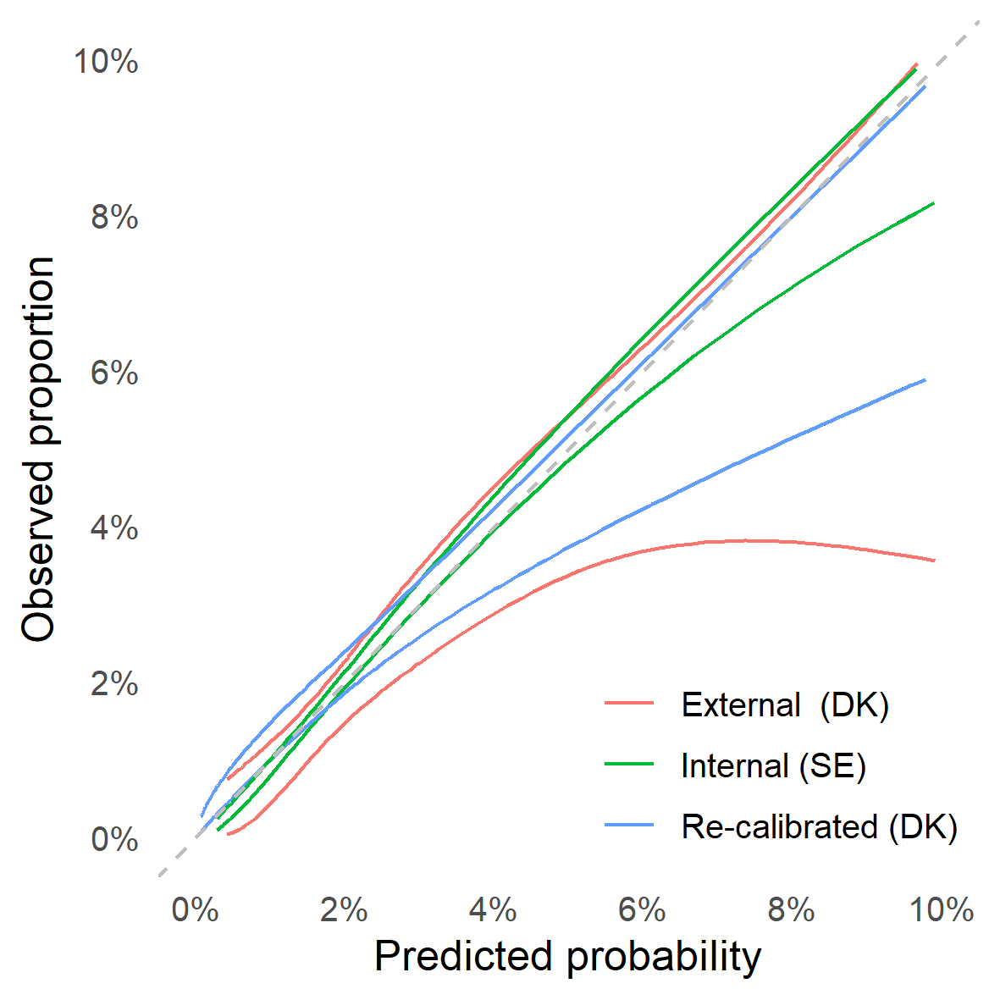

```{r setup, include = FALSE}
options(
  digits         = 2,
  knitr.kable.NA = '',
  repos          = list(CRAN = "https://cran.rstudio.com/")
)

knitr::opts_chunk$set(
  echo       = FALSE,
  out.width  = "100%", 
  out.height = "100%"
)

library(tidyverse)

nmbr <- function(x) format(as.numeric(trimws(as.character(x))), big.mark = ",") 

# Pre-load all cached files < 10 MB
cache_files <- dir("../cache", ".RData", full.names = TRUE)
filesizes <- do.call(file.size, list(cache_files)) / 2^20
Vectorize(load, "file")(cache_files[filesizes < 10], .GlobalEnv)
```


1. The Swedish Hip Arthroplasty Register, Gothenburg, Sweden
2. Department of Orthopaedics, Institute of Clinical Sciences, The Sahlgrenska Academy, University of Gothenburg, Gothenburg, Sweden
3. Department of Orthopaedics, Institute of Surgical Sciences, Uppsala University Hospital, Uppsala, Sweden

**Correspondance:** erik.bulow@vgregion.se; +46 70 08 234 28; Svenska Hoftprotesregistret, Registercentrum Vastra Gotaland, SE-413 45, Sweden


# Note!

MOst text in the article is automatically generated! Bold text is not!
It is thus possible that this text does not correspond to the rest!
It must be updated manually!


##### PAGE BREAK


```{r}
# Participants and methods --------------------------------------------
N_shar <- 
  table1 %>% 
  filter(what == "n") %>% 
  select(Total) %>% 
  pluck(1)

period <- paste(range(df$P_SurgYear), collapse = "-")


# Results -------------------------------------------------------------
crude_rate_90d <- sum(df$outcome_infection_90d) / nrow(df)
crude_rate_2y  <- sum(df$outcome_infection_2y) / nrow(df)


get_auc <- function(Time, model, version = "1") {
  data_auc_ci %>% 
  filter(Period == Time, Model == model) %>% 
  select(ends_with(version)) %>% 
  pluck(1)
}
```


# Abstract

**OJECTIVE: ** Periprosthetic joint infection (PJI) after total hip arthroplasty (THA) is a devastating complication with enormous impact on mortality, quality of life, and healthcare resources. Previous attempts at developing risk calculators are hampered by poor predictive performance of the proposed models or a lack of external validation, and no model is derived on a European population. We thus developed a parsimonious model to predict PJI within 90 days and two years after elective THA.

**PARTICIPANTS AND METHODS: ** We analysed `r nmbr(N_shar)` patients recorded in the Swedish hip arthroplasty register `r period` and obtained data on comorbidities and socioeconomic background variables from the National Patient Register and Statistics Sweden. Logistic least absolute shrinkage and selection operator (LASSO) regression was applied to develop prediction models for PJI within 90 days or two years after surgery. Models were internally validated by bootstrapping and externally validated on a cohort of **XXX** patients from **XXX**. We assessed model performance by analysing the area under the receiver operation characteristics curve (AUC) and by calibration belt plots.

**RESULTS: ** The crude incidence rate of PJI after THA was `r crude_rate_90d * 100` % within 90, days and `r crude_rate_2y * 100` % within two years in the Swedish derivation cohort. A prediction model for PJI within 90 days combined `r coefs_text["90 days"]`, resulting in an `r get_auc("90 days", "Reduced model", "2")` internally  and **(AUC=XXX, 95% CI: XXX to XXX)** externally. A model for PJI within two years had similar performance internally `r get_auc("2 years", "Reduced model")` and externally **XXX (95% CI: XXX to XXX)**. These models were superior to traditional models based on the American Society for Anesthesiologists (ASA) classification `r get_auc("90 days", "ASA class")`, Charlson `r get_auc("90 days", "Charlson")`, Elixhauser `r get_auc("90 days", "Elixhauser")`, and the Rx Risk V `r get_auc("90 days", "Rx Risk V")` comorbidity indices.

**CONCLUSION: ** The proposed prediction models for PJI after THA are relatively parsimonious since they are based on easily accessible clinical data, and they are superior to predictions based on ASA class or more complex comorbidity indices. Our web-based calculator could simplify the individualized risk assessment prior to THA surgery.


##### PAGE BREAK

# Introduction

Periprosthetic joint infection (PJI) is the most devastating of all early complications after total hip arthroplasty (THA), mainly due to its severity in terms of increased mortality, the required number of re-operations, long-term antibiotic treatment, and often persistently impaired quality of life.[@Zimmerli2006; @Kapadia2016; @Shohat2019] Many risk factors for the development of PJI are identified, with anemia, diabetes, and obesity being important, to some extent modifiable risk factors, whereas advanced age and male gender are examples of non-modifiable risk factors.[@Ridgeway2005; @Lai2007; @Malinzak2009; @Ong2009; @Pedersen2010; @Bozic2012; @Jamsen2012; @Rasouli2014a; @Maoz2015]
Individualized PJI risk stratification would be a highly desirable tool in the pre-operative assessment of patients scheduled for THA, but established measures of comorbidity such as the American Society for Anesthesiologists (ASA) classification or considerably more complex comorbidity indices cannot be used in this context. Although high ASA class is a risk factor associated with development of PJI, the classification is imprecise, and it was never developed for the purpose of predicting this specific complication.[@Haynes1995; @Berbari2012] 
The Charlson[@Charlson1987] and Elixhauser[@Elixhauser1998] comorbidity indices are based on `r nrow(coder::charlson)` or `r nrow(coder::elixhauser)` conditions coded by the International Classification of Diseases (ICD), respectively, but they are cumbersome to use in a clinical setting, and they were also not designed for prediction of specific adverse events after THA. The same is true for the Rx Risk V-classification with `r nrow(coder::rxriskv)` conditions codified by the Anatomical Therapeutic Chemical (ATC) Classification.[@Sloan2003; @Pratt2018]
Several attempts have been made at developing individualized risk prediction models for clinical usage, with the Universal American College of Surgeons National Surgical Quality Improvement Program (ACS NSQIP) Surgical Risk Calculator being one of the first.[@Edelstein2015; @Wingert2016a] Several other risk calculators for the risk of PJI after THA have since been derived on US or Australian cohorts, but none has gained general acceptance.[@Wingert2016a; @Bozic2013a; @Inacio2015a] This is mainly due to often limited, sometimes single-center based samples, low  discriminative ability or low accuracy of the prediction models, or the absence of external model validation.
Thus, there is an urgent need for improved prediction models of PJI. We therefore developed a prediction model of PJI within 90 days or two years after THA that is based upon easily accessible data that are available in the setting of clinical decision-making.


# Patients and Methods

We used data from the Swedish Hip Arthroplasty Register (SHAR) for model derivation and internal validation of discrimination and calibration. The best models were then validated externally on a cohort from the **XXX**.


## Derivation cohort (Sweden)

The derivation cohort was obtained from patients recorded in the SHAR `r period`. The starting point was chosen because registration of ASA class and body mass index (BMI) in the SHAR was initiated in 2008, and we had no access to data from the national patient register (NPR) after 2015. Data linkage was achieved by using personal identity numbers that are assigned to all Swedish residents at birth or immigration.[@Ludvigsson2009; @Cnudde2016] The diagnosis underlying the index THA procedure (categorized into `r glue::glue_collapse(tolower(levels(df$P_DiaGrp)), ", ", last = " and ") %>% {gsub("\\(avn\\)", "[AVN]", .)}`), type of fixation (cemented or uncemented stem and cup respectively), age at index surgery, sex, BMI, ASA class, type of hospital, and year of surgery, were obtained from the SHAR. Data on comorbidities for one year prior to index surgery were obtained from the NPR where diagnoses based on in- and outpatient episodes in all private and public hospitals are coded according to ICD-10 together with admission and discharge dates. Data on marital status and the educational level  of patients was obtained from the longitudinal integration database for health insurance and labor market studies (LISA) from Statistics Sweden. The SHAR has completeness of 96-98 % and 100 % coverage,[@Karrholm2018] the LISA has coverage of 98 % with 85 % accuracy, and completeness for the NPR is above 99 % and the positive predictive value is 85-95 %.[@Ludvigsson2011] Death dates were linked from the national population register. Only the last operated hip was considered for patients with bilateral THA.[@Bulow2020]. Patients with missing information on, or an ASA class of IV and above, were excluded, as were patients with missing information on BMI or a BMI above 50. Patients with missing information on educational levels or the type of hospital performing index surgery were also excluded. 


## External validation cohort (XXX)

## Definitions of comorbidity and outcomes

The Charlson, Elixhauser and Rx Risk V comorbidity indices are based on the presence of ICD-10 and ATC codes grouped into main categories (`r nrow(coder::charlson)`, `r nrow(coder::elixhauser)` and `r nrow(coder::rxriskv)` respectively).[@Quan2005; @Pratt2018] Diagnostic categories from all indices were combined to define `r nrow(tab_categorization)` categories of comorbidity that were chosen in order to be easily identifiable in a clinical setting (Tab. \@ref(tab:tabcategorization)). Some of the combined comorbidities were observed for less than 10 patients with or without PJI. These diagnoses were not considered as potential predictors to reduce the risk of overfitting to spurious events. PJI was defined by the occurrence of relevant ICD-10 or procedural NOMESCO-code recorded in NPR within 90 days or 2 years (Tab. \@ref(tab:infcodes)), or if the patient was reported to SHAR, within the same time frame, as reoperated due to infection.


## Model development

Model development was performed by bootstrap ranking and a logistic least absolute shrinkage and selection operator (LASSO).[@Guo2015; @Baranowski2020] Age was normalized prior to modeling, and the estimated coefficients thus indicated variable importance on the same scale as categorical variables. BMI divided into four intervals based on the six intervals proposed by the World Health Organization (WHO; $<25$: under- or normal weight, $25-29.9$: overweight, $30-34.9$: class I obesity, $\geq 35$: class II-III obesity).

For each outcome (PJI within 90 days or 2 years), ten-fold cross validation was performed with a range of potential penalty values ($\lambda_i$:s) in a logistic LASSO regression model. We kept the $\lambda_i$ that minimized the mean cross-validated deviance. 100 bootstrap samples were then drawn from the observed data set.[@Austin2004] 

Logistic LASSO regression was performed for each sample using the chosen $\lambda_i$ as penalty term. Regression coefficients were ranked based on their absolute values as a measure of variable importance. We then used Bayesian methods to estimate a posterior distribution and to identify two change points in a linear segmented piecewise regression model. The second change point was then used as a break-point. Influential predictors with absolute coefficients value above this point, scored a point. The whole process, each with 100 Bootstrap replicates, was repeated 100 times (yielding 10,000 bootstrap samples in total). Potential predictors that were selected at least once out of 100 were then used in main effects multivariable logistic regression models without penalty and without pre-normalization of numeric variables. Even more parsimonious models with potential predictors chosen at least 50 out of 100 times were evaluated for comparison. Univariable prediction models based on either ASA class, the Charlson, Elixhauser, or the Rx Risk V comorbidity indices were fitted for comparison. Odds ratios for the final models were estimated with 95 % confidence intervals.


## Model validation

Each developed model was used to predict the probability of PJI within 90 days or two years for patients derived from the SHAR (internal validation). Receiver operating characteristic (ROC) curves and their corresponding areas under those curve (AUC) were used to describe discrimination with 95 % confidence intervals that were based on percentiles from 2,000 non-parametric bootstrap samples. The bias-corrected Somers' $D_{xy}$ rank correlation based on 100 resamples was used to adjust for optimism, 
but the correction for optimism only affected the third decimals in the presented results, and will therefore not be further discussed. Predicted probabilities and observed proportions were plotted with 95 % confidence intervals to graphically assess model calibration.[@Nattino2016] The derived models were externally validated on a **XXX** cohort, and re-calibration of model intercepts was performed to account for different PJI incidences in Sweden compared to **XXX**. Calibration for this re-calibrated model was illustrated in the same calibration belt plot as after internal calibration.


## Statistical tools

We built an online web calculator available at https **XXX** to be used in clinical practice. R software (version 3.6.1; R Foundation for Statistical Computing, Vienna, Austria) with significant packages tidyverse, tidymodels, furrr, pROC, decoder, coder and shiny were used.

## Ethical approval

Ethical approval for this study was obtained from the Regional Ethical Review Board in Gothenburg (360-13) and **XXX**.


# Results


```{r}
age <- sprintf("%.0f (SD = %.0f)", mean(df$P_Age), sd(df$P_Age))

comorb <- function(x) {
  sprintf("%.0f %% (n = %s)", mean(x) * 100, nmbr(sum(x)))
}
```

## Study participants

We included `r nmbr(N_shar)` patients (`r mean(df$P_Sex == "Male") * 100` % males) with a mean age of `r age` years in the derivation cohort from the SHAR (Fig. \@ref(fig:flowchart), left panel). 
`r crude_rate_90d * 100` % (n = `r sum(df$outcome_infection_90d)`) of the patients developed a PJI within 90 days, and `r crude_rate_2y * 100` % (n = `r sum(df$outcome_infection_2y)`) within 2 years (Tab. \@ref(tab:tab1)). The proportion of patients with ASA class III was
`r comorb(df$P_ASA == "III")`; `r comorb(df$CCI_index_quan_original > 0)` had at least one comorbidity according to the Charlson comorbidity index, `r comorb(df$ECI_index_sum_all > 0)` according to Elixhauser, and `r comorb(df$Rx_index_pratt > 0)` according to Rx Risk V. In addition, **XXX** patients from **XXX** were included as an external validation cohort (Fig. \@ref(fig:flowchart), right panel).


## Model development and internal validation

Patients with `r excl_factors` were uncommon, wherefore those comorbidities were excluded as potential predictors prior to further modeling. ROC-curves (Fig. \@ref(fig:rocs)) and AUC-values (Fig. \@ref(fig:aucci)) for the main and reduced models were no different. For simplicity, we therefore focus on the reduced models. Estimated probability density curves for patients with and without PJI were partially overlapping, although patients with PJI had on average higher predicted probabilities for such event (Fig. \@ref(fig:sep)). 

The reduced model for the prediction of PJI within 90 days in the Swedish cohort included `r coefs_text["90 days"]` (Tab. \@ref(tab:coefs)). Predictors associated with a statistically significant risk increase were **secondary osteoarthritis as the underlying reason for THA surgery, male gender, obesity, and the presence of psoriasis, osteoporosis, Paget's or liver disease**. This reduced model for the predicition of PJI within 90 days had an `r get_auc("90 days", "Reduced model", "2")`, whereas ASA class `r get_auc("90 days", "ASA class")`, the Charlson comorbidity index `r get_auc("90 days", "Charlson")`, the Elixhauser comorbidity index `r get_auc("90 days", "Elixhauser")`, and Rx Risk V `r get_auc("90 days", "Rx Risk V")` had less discriminative ability (Fig. \@ref(fig:rocs) and \@ref(fig:aucci)). The reduced model had good accuracy as seen by the calibration plot (Fig. \@ref(fig:calibration), left panel).

The reduced model for PJI within two years included the same predictors, with the addition of `r coefs_text["2 years"]` (Tab. \@ref(tab:coefs)). Predictors conferring a statistically significant risk increase were those **mentioned as predictive for PJI within 90 days, excluding osteoporosis or Paget's disease, and additionally included an underlying diagnosis of AVN or inflammatory joint disease, and the presence of  CNS disease**. The reduced model for the prediction of PJI within two years had an `r get_auc("2 years", "Reduced model", "2")`, whereas ASA class `r get_auc("2 years", "ASA class")`, the Charlson comorbidity index `r get_auc("2 years", "Charlson")`, the Elixhauser comorbidity index `r get_auc("90 days", "Elixhauser")`, and Rx Risk V `r get_auc("90 days", "Rx Risk V")` again had less discriminative ability (Fig. \@ref(fig:rocs) and \@ref(fig:aucci)). Calibration was good for the reduced model (Fig. \@ref(fig:calibration), right panel). 


## External validation

XXX


# Discussion

## Principal findings

We found that a multivariable main effects logistic regression model based on some easily identifiable clinical conditions, gender, and BMI was considerably better at predicting PJI within 90 days after THA than models based on either ASA class or the Charlson, Elixhauser or Rx Risk V comorbidity indices. A similarly developed model to predict PJI within two years included similar predictors as the model developed to predict PJI within 90 days, but added `r coefs_text["2 years"]` to the list of predictor variables. This model also performed better than the established comorbidity measures in terms of AUC and calibration.


## Clinical usage

Since the prediction models both for PJI within 90 days and within two years were based on easily accessible information they can be translated into a simple formula $\hat p = 1/(1 + e^{-\hat \alpha - \mathbf{\hat \beta X}})$ where $\hat p$ is the estimated probability, $\hat \alpha$ and $\mathbf{\beta} = \hat\beta_1, \hat\beta_2, \ldots, \hat\beta_k$ are the estimated intercept and coefficients (Tab. \@ref(tab:coefs)) and $\mathbf{X} = X_1, X_2, \ldots, X_k$ are corresponding patient characteristics. For example, `r examples$desc[[1]]` for PJI within 90 days; `r examples$desc[[2]]`. 


## Model predictors

The predictors in our models were chosen based on a strict analytical approach, not on proposed relevance of patient or procedure characteristics. The majority of the identified predictor variables are however associated with the risk of developing PJI in previously developed prediction models and within the setting of observational studies, which is supportive of our own models.

Patients with primary osteoarthritis seem less prone to developing PJI than patients receiving THA for other reasons, and in agreement with previous observational data we found that both AVN and secondary osteoarthritis conferred a nearly two-fold increased risk of PJI in our prediction models.[@Pedersen2010a; @Dale2012] Rheumatoid arthritis as the diagnosis underlying THA surgery is pointed out as a risk factor for PJI,[@Bozic2012; @Inacio2015a] and this predictor variable was statistically significance in our model of PJI within two years. 

Obesity is associated with an increase in the risk of reoperations or adverse events after THA[@Sayed-Noor2019] and with the risk of developing surgical site infections or PJI after total hip or knee arthroplasty.[@Malinzak2009; @Jamsen2012; @Maoz2015; @Everhart2013] Obesity is identified as a risk factor for PJI in a risk calculator derived on two independent US institutional cohorts, which agrees with our identification of obesity as a predictor variable in both models.[@Tan2018] In accordance with observational studies[@Jamsen2012] we found the presence of CNS diseases to be a predictor of PJI within two years, and our rather broad category encompasses both cerebrovascular disease, dementia, hemiplegia, and Parkinson's disease which were all associated with a risk increase in the cited study. 

Male gender is associated with an increased risk of developing PJI after arthroplasty surgery,[@Dale2012] and gender is included as a predictor variable in several previously developed risk calculators.[@Wingert2016a; @Tan2018] 
Patients with liver cirrhosis are described to have a more than doubled risk of suffering from PJI within one year after THA, supporting our finding of the presence of liver diseases among our predictor variables.[@Deleuran2015]Taken together, the above cited findings support that the predictor variables in our models seem to be relevant in the context of predicting PJI.

Some previously mentioned risk factors for developing PJI were not selected during our model development. High ASA class is frequently associated with an increased risk of PJI,[@Berbari2012; @Pulido2008; @Namba2012] as are comorbidity in a broader sense, and, more specifically, the presence of cardiovascular comorbidity.[@Ong2009; @Higuera2011] In contrast, we found that ASA class alone was an insufficient predictor of PJI, and none of the cardiovascular disease categories remained as a predictor variable in our final main model. 


Cancer seems to confer an increased risk of PJI in several observational studies,[@Bozic2012; @Everhart2013; @Poultsides2013] and it is one of the defined comorbidities in the ACS NSQIP Surgical Risk Calculator,[@Wingert2016a]
20 but this comorbidity did not reach statistical significance in our models.

THA fixation using cement without antibiotics confers an increased risk of PJI,[@Dale2012] but such cement brands were not in clinical use in Sweden during the studied period. We found no indication that the type of fixation was associated with the risk of PJI, and this variable was also not selected as a potential predictor variable in any of the iterations during model development.


Although mentioned as risk factors for surgical site infections after joint arthroplasty,[@Rasouli2014a; @Inacio2015a] prediction models based on the comorbidity indices developed by Charlson or Elixhauser and the RxRisk V index alone, resulted in poor predictive power. This agrees with previous findings describing that these measures of comorbidity rather poorly predict mortality and patient reported outcomes after THA.[@Bulow2017; @Bulow2019]


## Strengths and limitations

Our study is hampered by the limitations inherent to observational research, such as misclassification, and residual confounding due to known confounders that we had no information on, or due to unknown confounders. Importantly, some previously identified risk factors for PJI were not included in our models, mostly because we lacked detailed information on laboratory findings and non-prescribed medications.


The presence of diabetes was not among the predictor variables selected in our models, although it was almost double as frequent among patients with PJI than among those without (data not shown). This is in disagreement with numerous observational studies describing an increased risk of developing PJI after both THA or total knee arthroplasty,[@Pedersen2010; @Maoz2015; @Everhart2013] and diabetes is also found among the risk factors in previously developed risk calculators.[@Wingert2016a; @Tan2018; @Inacio2015] On the other hand, diabetes is not consistently found to be associated with the risk of surgical site infection or PJI after THA surgery.[@Namba2012] Peri-operative hyperglycemia is a predictor of PJI after total joint replacement of the hip or knee, and information on laboratory parameters such as morning blood glucose or HBA1c could have improved the predictive power of our models, but we had no access to such information.[@Mraovic2011; @Iorio2012] In analogy, low preoperative hemoglobin is associated with the risk of developing surgical site infection,[@Rasouli2014a] but although we had access to the ICD codes defining the presence of anemia, we had no information on actual laboratory findings. 
Use of TNF-a blockers may be associated with the risk of developing PJI.[@Gilson2010; @Momohara2011] Similarly, intra-articular steroid application may enhance this risk,[@Cancienne2015] but injections given by physicians would not necessarily be identifiable within a Swedish registry setting. Operating times, or, in the case of knee surgery, tourniquet times, are associated with the risk of PJI after hip or knee joint replacement,[@Maoz2015; @Willis-Owen2010] and procedure time is one of the risk factors in the Mayo PJI risk score,[@Berbari2012] but we had no information on this potentially important parameter. The question of what other variables might be needed to further refine prediction models remains open, but information that is notoriously difficult to obtain within the setting of large register studies, such as smoking status, might be of value.

Taken together, the inclusion of some or all of the variables mentioned above -- unfortunately unavailable to us -- might improve the predictive power of PJI risk assessment models. 


## Conclusion

Our results indicate that the risk of PJI after THA can be pre-operatively assessed by a parsimonious prediction model. We hope that this model, with its accompanying web calculator, will facilitate shared decision-making between physicians and their patients in need of THA.


##### Page break


# Contribution of authors

NPH initiated the study, OR managed the ethical review board application in Sweden, EB developed the statistical model, **XXX** performed external validation with data from **XXX**. NPH and EB drafted, and all authors edited and finalized the manuscript.


# Competing interest statement

All authors have completed the ICMJE uniform disclosure form at www.icmje.org/coi_disclosure.pdf and declare ...


# Transparency Statement

NH, the principal investigator of this study, affirms that this is an accurate report with no relevant data or aspects omitted.


# Public and patient involvement statement

There is a patient representative at SHAR to ensure the patients' interests are respected in planned research.


# Data sharing statement

Data is available upon reasonable request to the principal investigator.


# Acknowledgement

We would like to thank .

##### PAGE BREAK

<!-- FIGURES -->

```{r flowchart, fig.cap = "Flowchart with inclusion criteria and number of patients. Data from the Swedish Hip Arthroplasty Register were used for model derivation and internal validation (left). Data from XXX were used for external validation (right)."}
knitr::include_graphics("../graphs/flowchart.png")
```

##### PAGE BREAK

```{r rocs, fig.cap = "Receiver Operation Characteristics (ROC) curves combines sensitivity and specificity tp illustrate discriminative abilities of the different models. The reduced model perform almost as good as the main model for prediction of PJI within 90 days after surgery, and as good for PJI within 2 years."}
knitr::include_graphics("../graphs/roc.png")
```

##### PAGE BREAK

```{r aucci, fig.cap = "Area Under the Receiver Operation Characteristics Curve (AUC) as a measure of predictive discriminative ability with 95 % bootstrap confidence intervals. The reduced model performs no different than the main model, but both of these perform better than traditional comorbidity measures alone."}

knitr::include_graphics("../graphs/auc_ci.png")
```

##### PAGE BREAK

```{r sep, fig.cap = "The vast majority of patients did not have PJI. Hence, the blue bars dominates the histograms (upper panels; note the scales). Normalized density plots reveals however, that patients with PJI had, on average, higher estimated probabilities for this adverse event (lower panels)."}
knitr::include_graphics("../graphs/separation.png")
```

##### PAGE BREAK

```{r calibration, fig.cap = "This figure illustrates calibration between observed proportions and predicted probabilities with 95 % confidence intervals. Calibration is good for predictions up to 5 %, although higher probabilities tend to over-estimate the observed outcome. "}

```

<!-- Tables -->

##### PAGE BREAK

```{r tabcategorization}
load("../cache/tab_categorization.RData")

tab_categorization %>%
  ungroup() %>% 
  mutate(
    `Comorbidities by groups` = 
      gsub("Heart infarct", "Myocardial infarction", `Comorbidities by groups`)
  ) %>% 
  knitr::kable(
    caption = "Categorization of comorbidities from the Charlson, Elixhauser and Rx RIsk V comorbidities. (CNS = central nervous system.)")

```

##### PAGE BREAK

```{r infcodes}
library(coder)

icd10_codes <- 
  summary(
      hip_ae_hailer, 
      "icd10se", 
      cc_args = list(regex = "icd10", stop = TRUE)
    )$codes_vct$Infection %>% 
    paste(collapse = ", ")

nomesco_codes <- 
  summary(
      hip_ae_hailer, 
      "kva", 
      cc_args = list(regex = "kva", stop = TRUE)
    )$codes_vct$Infection %>% 
    paste(collapse = ", ")

tibble(
  classification = c("ICD-10", "NOMESCO"),
  codes = c(icd10_codes, nomesco_codes)
) %>% 
  knitr::kable(
    caption = "Codes identifying infection if recorded in the national patient register within 90 days or 2 years after THA respectively."
  )

```


##### PAGE BREAK

```{r tab1, warning=FALSE}
source("../lib/clean_names.R")

knitr::kable(
  mutate(table1, what = gsub("Heart infarct", "Myocardial infarction", what)), 
  caption = "Patient characteristics in the model derivation cohort. Educational levels were classified as low (up to 9 years), middle (10-12 years) and high (at least 12 years). BMI = Body mass index. ASA class = American Society for Anesthesiologists classification. CNS = central nervous system.") 
```

##### PAGE BREAK

```{r brlprop}
load("../cache/infection_data.RData")

infection_data %>% 
  select(outcome, time, coefs_selected) %>% 
  mutate(coefs_selected = map(coefs_selected, "brlasso_tbl_selected")) %>% 
  unnest("coefs_selected") %>%
  filter(outcome == "infection") %>% 
  select(-outcome) %>% 
  pivot_wider(names_from = "time", values_from = "n") %>% 
  mutate(
    variable = clean_names(variable) %>% 
      {gsub("\\.", " ", .)} %>% 
      {gsub("Rheumatidisease", "Rheumatic disease", .)} %>% 
      {gsub("Sex Male", "Male gender", .)}
  ) %>% 
  select(Predictor = variable, `90 days` = `90d`, `2 years` = `2y`) %>% 
knitr::kable(
  caption = "Variables selected by the bootstrap ranking procedure, and therefore kept in the main model. Variables chosen at least 33 times out of 100 were kept in the reduced model as well. (BMI = body mass index. ASA class = American Society for Anesthesiologists classification. CNS = central nervous system.)")
```

##### PAGE BREAK

```{r coefs}
tbl_coefs_present %>% 
  mutate(
    time = replace(as.character(time), duplicated(time), ""),
    beta = round(beta, 2)
  ) %>% 
knitr::kable(
  caption = 'Estimated coefficients (beta) and odds ratios (OR) with 95 % confidence intervals for the reduced models. BMI = body mass index ("under/normal weight as baseline). CNS = central nervous system. Primary osteoarthritis was baseline for diagnosis and female was baseline for sex.'
)
```


##### PAGE BREAK

# Bibliography
