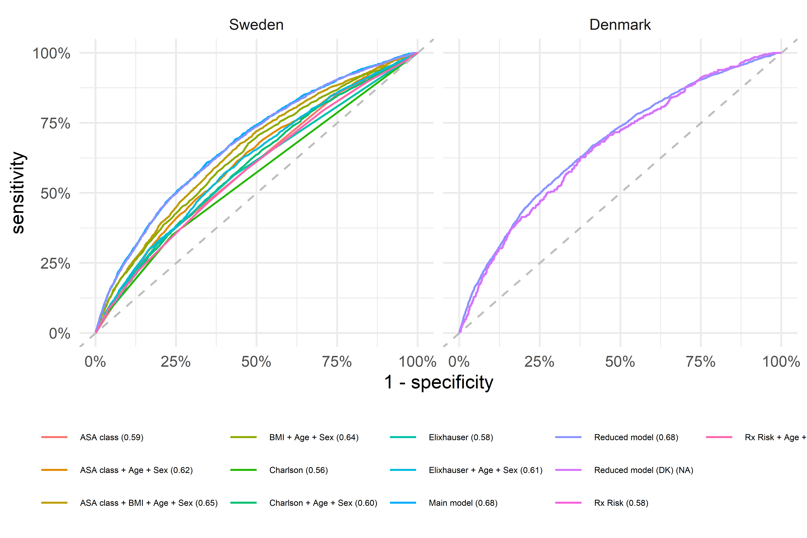

```{r setup, include=FALSE}
knitr::opts_chunk$set(echo = TRUE)
library(tidyverse)
source("../lib/clean_names.R")
model_data <- readRDS("../cache/model_data.rds")
```

# Note!

I will present both outcomes since it is easier for now. I will make separate figures and tables later for each publication separately.

# Data

Linked data from:

- SHAR: THA-related
- Census (folkbokforing): death
- National Patient Register: co-morbidity
- LISA: education, civil status.
- Prescription register: ATC codes for Rx Risk V


# Inclusion

```{r}
knitr::include_graphics("../graphs/flowchart.png")
```

# Comorbidity

- Charlson: 1 year prioir to surgery. ICD-10-codes as defined by @Quan2005 with index weights by @Charlson1987.
- Elixhauser: 1 year prioir to surgery. ICD-10-codes as defined by @Quan2005 with unweighted sum as index.
- Rx Risk V: 1 year prioir to surgery. ATC-codes and index as defined by @Pratt2018.

Individual groups from all above grouped as:

```{r, message=FALSE}
load("../cache/tab_categorization.RData")
mutate_all(tab_categorization, coalesce, "")
```

# Outcomes

Infection and dislocation as identified at reoperation in SHAR or from later recordings in NPR (ICD-10 or KVA).

Within 2 years and 90 das.


# Rare conditions

We only kept potential predictors with at least 10 patients with and without respective outcome.
Dropped variables are listed in the table. Most conditions were dropped due to too few patients with the condition who experienced the event ("event_cond"). Some conditions were so rare that there was not enough patients even without the event ("no event_cond").

```{r}

model_data %>% 
  select(outcome, time, lgl) %>% 
  unnest("lgl") %>% 
  group_by(outcome) %>% 
  mutate(time = replace(time, duplicated(time), "")) %>% 
  ungroup() %>% 
  mutate(outcome = replace(outcome, duplicated(outcome), ""))

```

We did the same check for individual levels of categorical variables:

```{r}

model_data %>% select(outcome, time, fct)
```

Hence, patients with childhood disease were excluded for prediction of infection within 90 days.
This, this model was trained on `r  model_data %>% filter(!is.na(fct)) %>% select(n_df0) %>% pluck(1)` patients.


# Summary tables

We make those for outcome within 2 years, but this could be modified!

## Infection

```{r}
load("../cache/table1_infection.RData")
table1_infection$table1
```

## Dislocation

```{r}
load("../cache/table1_dislocation.RData")
table1_dislocation$table1
```


# Models

The variable selection process is rerun 100 times. Some variables are always included (n = 100), some are less common. 

```{r}
model_data %>% 
  select(outcome, time, coefs_selected) %>% 
  mutate(coefs_selected = map(coefs_selected, "brlasso_tbl_selected")) %>% 
  unnest("coefs_selected") %>% 
  group_by(outcome) %>% 
  mutate(time = replace(time, duplicated(time), "")) %>% 
  ungroup() %>% 
  mutate(outcome = replace(outcome, duplicated(outcome), ""))
```

We use all variables for the "main models" but only variables selected at least 75 times out of 100 are included in the reduced models.

It might be relevant however to decrease the cut-of to a lower number, perhaps 20? The reason is that the full model is superior to the reduced model but that it feels a little unnecessary to include variables that were seldom selected.


# Internal validation

## ROC-curves

We can see that the main model with age as RCS is superioir for all outcomes, although the main model with age as a main effect is not far behind for infection within 2 years.

```{r}

```

## AUC

Unfourtenately, no model had AUC above 0.7. The main models seem preferable although the added value of age as RCS is not significant. Main effects model might be preffered due to simplicity?

```{r}
knitr::include_graphics("../graphs/auc_ci.png")
```

## Separation

There is not much separation between patients with and without each outcome (main models with age as main effect).

```{r}
knitr::include_graphics("../graphs/separation.png")
```


## Calibration

The 90 day infection model is not well calibrated, the 2 year model is!


```{r}
knitr::include_graphics("../graphs/calibration.png")
```

# Model parameters

Note that we have here included all levels from variables included with any level in the models. Hence all diagnoses, although some are not differnet from baseline. This should probably be changed to another baseline and without "others" etc. After that, we might merge some of the levels etc.

I include all models here since they can be looked at separately (compared to the graphs which would be very messy).

```{r}
load("../cache/tbl_coefs.RData")

tbl_coefs %>% 
  select(-Model, -math) %>% 
  group_by(outcome) %>%
  mutate(time = replace(as.character(time), duplicated(time), "")) %>% 
  ungroup() %>%
  mutate(
    outcome = replace(outcome, duplicated(outcome), ""),
    beta = round(beta, 2)
  )

```
 

# Bibliography
