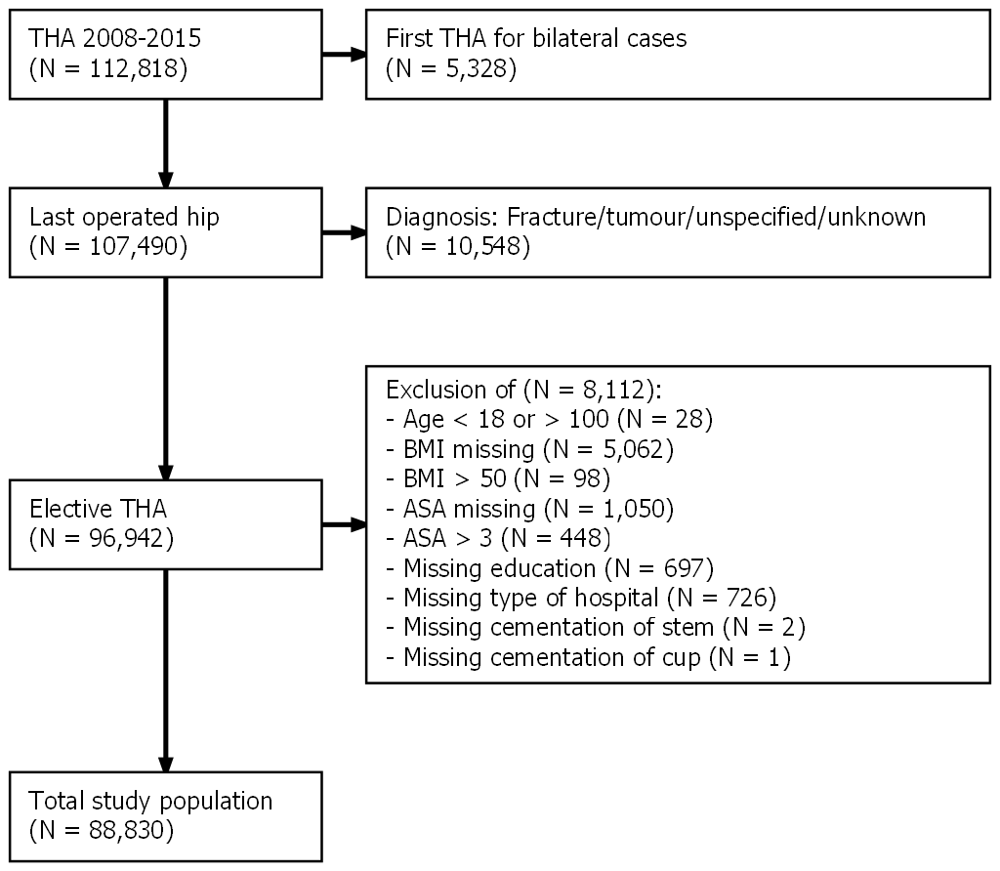

<!-- FIGURES -->

```{r flowchart, fig.cap = "Flowchart depicting inclusion criteria and number of patients. Data from the Swedish Hip Arthroplasty Register were used for model derivation and internal validation (left). Data from XXX were used for external validation (right)."}

```

##### PAGE BREAK

```{r rocs, fig.cap = "Receiver Operation Characteristics (ROC) curves."}
knitr::include_graphics("../graphs/roc.png")
```

##### PAGE BREAK

```{r aucci, fig.cap = "Area Under the Receiver Operation Characteristics Curve (AUC) as a measure of predictive discriminative ability with 95 % bootstrap confidence intervals. AUC above 0.7 were considered good."}

knitr::include_graphics("../graphs/auc_ci.png")
```

##### PAGE BREAK

```{r sep, fig.cap = "The vast majority of patients did not have an infection after THA, and therefore the blue bars dominate the histogram (upper panel; note the scales). Normalized density plots however reveals that patients who died within 90 days were, on average, estimated to have a higher probability to do so (lower panel)."}
knitr::include_graphics("../graphs/separation.png")
```

##### PAGE BREAK

```{r calibration, fig.cap = "This figure illustrates calibration between observed proportions and predicted probabilities with 95 % confidence intervals."}
knitr::include_graphics("../graphs/calibration.png")
```
